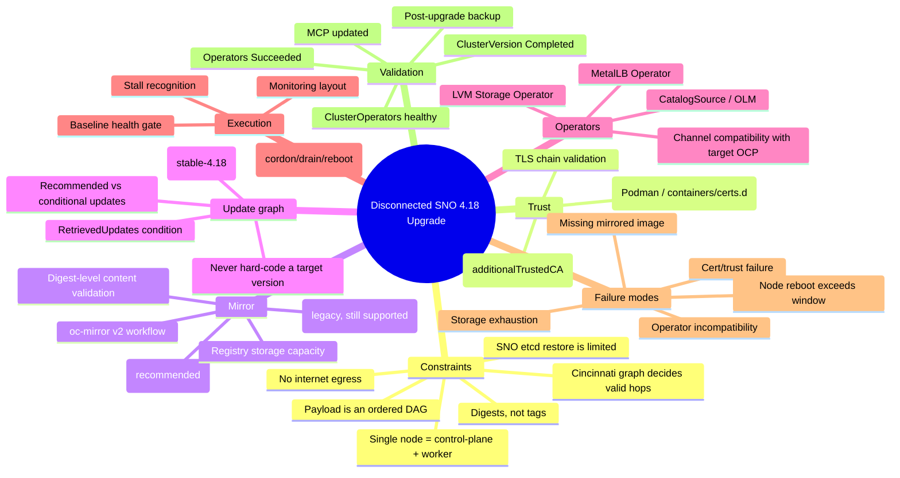
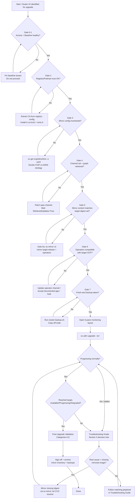
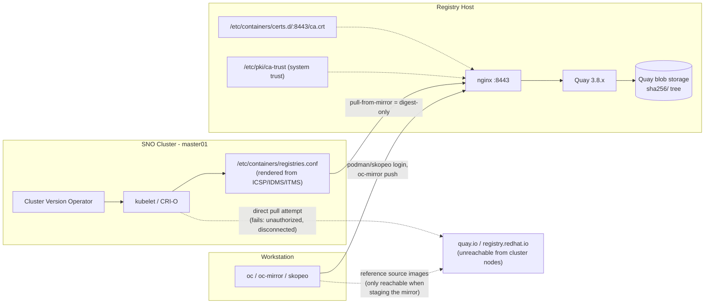
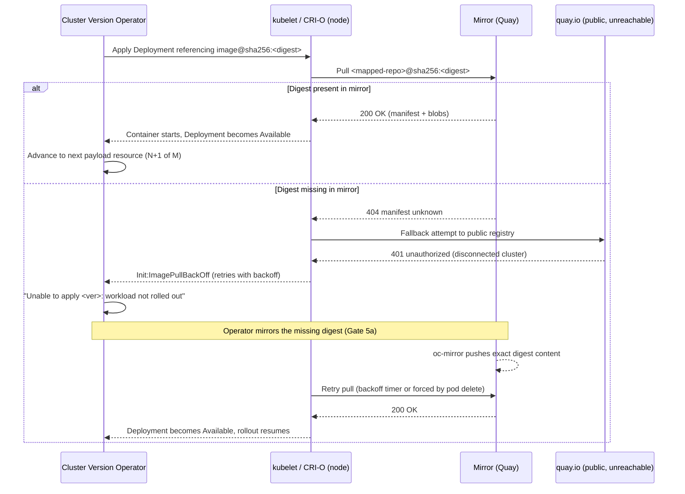

# Mind Map & Diagrams

All diagrams are provided twice: as **Mermaid** (renders natively on GitHub,
GitLab, VS Code, Obsidian, etc.) and as **ASCII** (renders anywhere,
including inside the exported Word document and plain terminals). The
Mermaid source files also live standalone under `diagrams/*.mmd`.

## 1. Mind map — the whole upgrade problem space




### ASCII equivalent

```
                              Disconnected SNO 4.18 Upgrade
                                          |
     -------------------------------------------------------------------------
     |            |            |            |            |          |       |
Constraints    Trust        Mirror      UpdateGraph   Operators  Execution Validation
  |               |            |            |            |          |       |
 no egress    cluster trust  ICSP/IDMS    channel      MetalLB   baseline  CVO=Completed
 SNO=1 node   host trust     oc-mirror    RetrievedUpd  LVM       monitor   CO healthy
 ordered DAG  TLS chain      digest check never-hardcode CatalogSrc expected  MCP updated
 digest pin                  storage cap  target ver    channel   automation ops Succeeded
 graph hops                                             compat    stall-detect backup
 SNO restore
 limited
```

## 2. Execution flow (flowchart)




### ASCII equivalent (condensed)

```
[Gate 0-1: access+baseline] --fail--> fix, loop back
        | pass
[Gate 2: registry/host trust] --fail--> extract CA, install, loop back
        | pass
[Gate 3: mirror inventory] --fail--> classify ICSP/IDMS, loop back
        | pass
[Gate 4: channel + graph] --fail--> set channel, wait, loop back
        | pass
[Gate 5: mirror content == target digests] --fail--> Gate5a oc-mirror, loop back
        | pass
[Gate 6: operator compatibility] --fail--> update/accept/hold, loop back
        | pass
[Gate 7: fresh etcd backup] --fail--> take backup, loop back
        | pass
[Open monitoring] -> [oc adm upgrade --to=<recommended>]
        |
   progressing? --stalled--> Troubleshooting decision tree
        |                          |
        |                    missing image? --yes--> mirror it, resume
   reached target? --no--> back to troubleshooting
        | yes
[Post-upgrade validation A-E] -> [Sign-off] -> DONE
```

## 3. Logical / architecture diagram — disconnected mirror path




### ASCII equivalent

```
 Workstation                     Registry Host                          (unreachable)
+-----------------+   login/    +--------------------------+   images   +----------------+
| oc / oc-mirror / |--push----->| nginx:8443 -> Quay 3.8.x  |<-- staged--| quay.io /       |
| skopeo            |           |   |                        |  from    | registry.redhat |
+-----------------+             |   v                        |  here    | .io             |
                                 | blob storage (sha256/*)   |          +----------------+
                                 | certs.d/ca.crt (Podman)   |
                                 | /etc/pki/ca-trust (system)|
                                 +--------------------------+
                                            ^
                                            | pull-from-mirror = digest-only
                                            |
                              +-------------------------------+
                              | SNO node (master01)            |
                              | CVO -> kubelet/CRI-O           |
                              | registries.conf (rendered      |
                              |   from ICSP / IDMS / ITMS)     |
                              +-------------------------------+
```

## 4. Sequence diagram — image pull during CVO rollout (success vs. failure path)




## Notes on rendering these diagrams

- GitHub, GitLab, Obsidian, and recent VS Code render Mermaid fenced blocks
  automatically.
- To render standalone images (PNG/SVG) for a slide deck, use
  [`@mermaid-js/mermaid-cli`](https://github.com/mermaid-js/mermaid-cli):

  ```bash
  npx -y @mermaid-js/mermaid-cli -i diagrams/execution-flow.mmd -o diagrams/execution-flow.svg
  ```
- The `.mmd` sources for each diagram above are saved individually under
  `diagrams/` for exactly this purpose.
