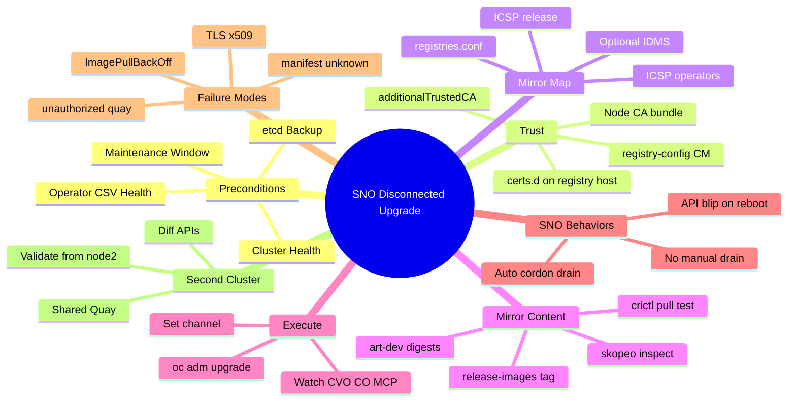
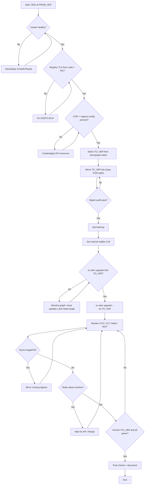
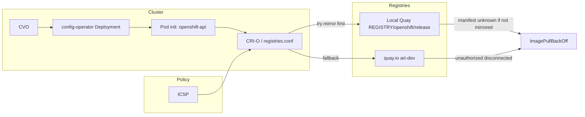
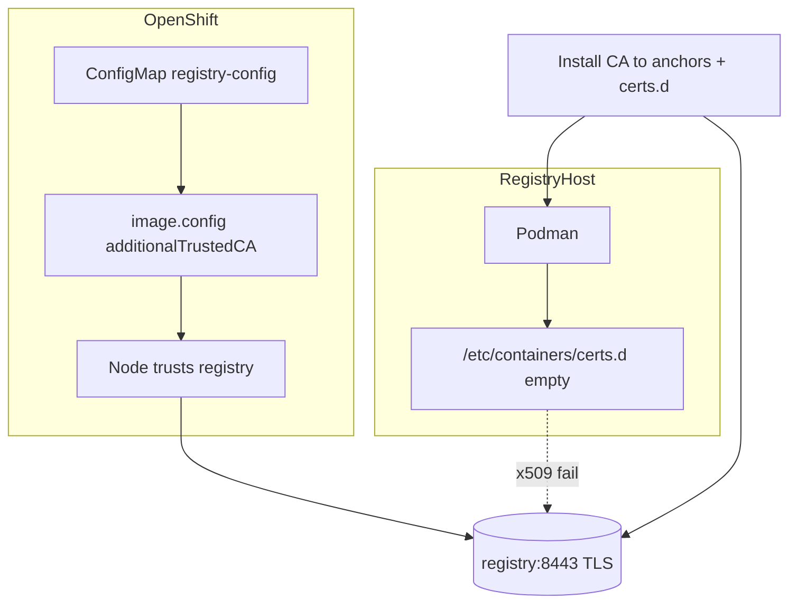
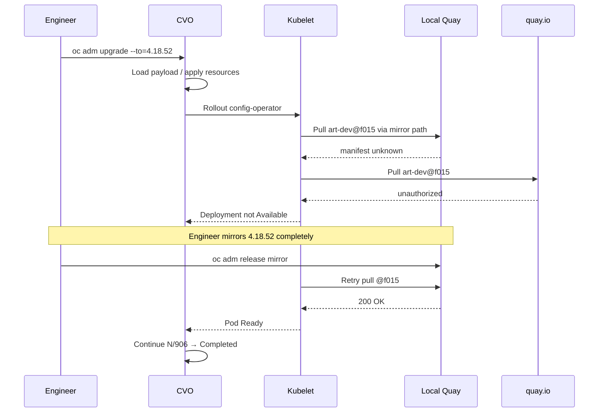
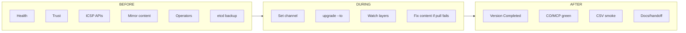
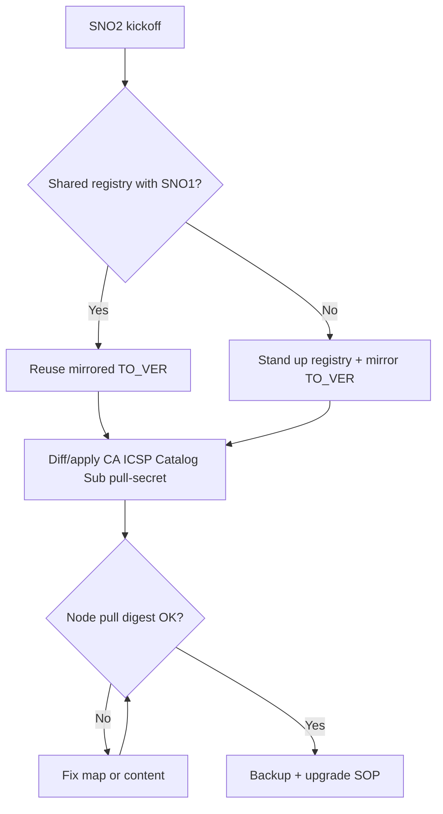

# 07 — Mind Map, Execution Flow, Logical Diagrams

Render these Mermaid diagrams in any Mermaid-compatible viewer (GitHub, GitLab, many Markdown previews).

---

## 1. Mind map — disconnected SNO upgrade domain



---

## 2. Execution flow (happy path)



---

## 3. Logical diagram — image pull path



---

## 4. Logical diagram — trust asymmetry (incident warmup)



---

## 5. Sequence — failure then recovery



---

## 6. Swimlane — before / during / after



---

## 7. Decision — SNO #2 readiness



---

## 8. ASCII mind map (printable)

```text
                     DISCONNECTED SNO UPGRADE
                                |
        +-----------------------+-----------------------+
        |                       |                       |
     PREP                    EXECUTE                  VERIFY
        |                       |                       |
   Health/Backup          Channel+Upgrade         CV Completed
   Trust/CA               Multi-watch             CO/MCP green
   ICSP APIs              No manual drain         Operators OK
   Mirror CONTENT         Content repair loop     Docs
        |
        +-- SNO2 parity (diff APIs, validate from its node)
```
