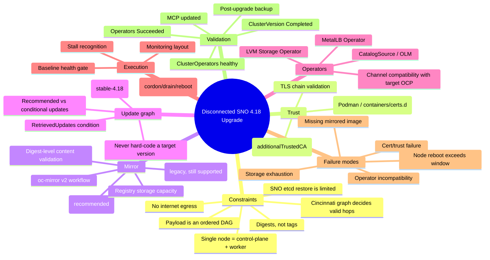
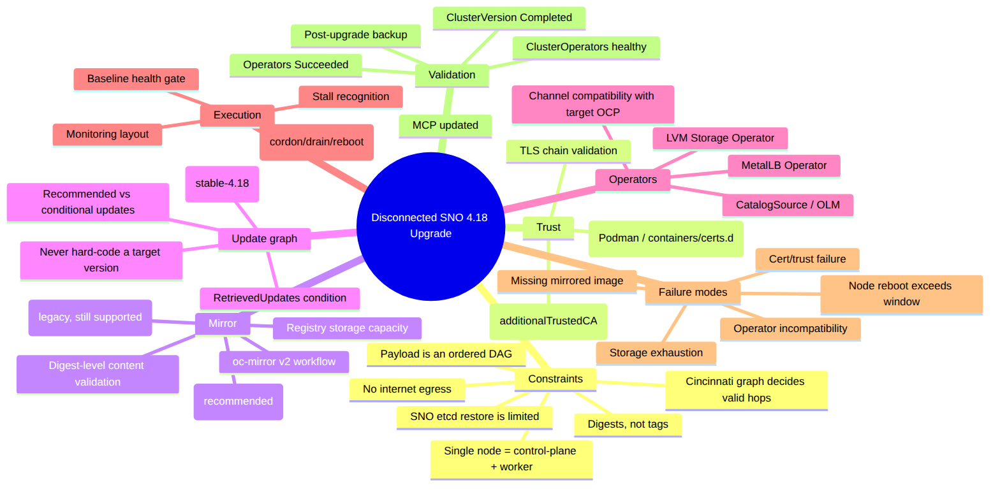
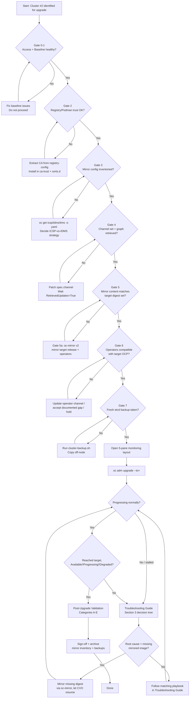
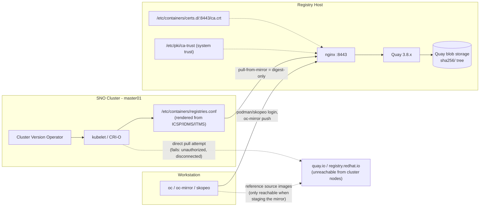
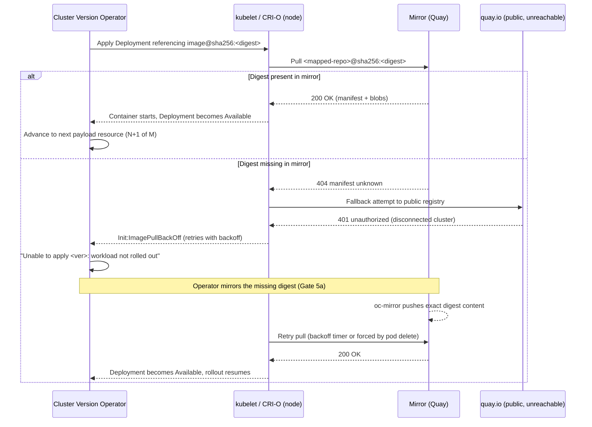
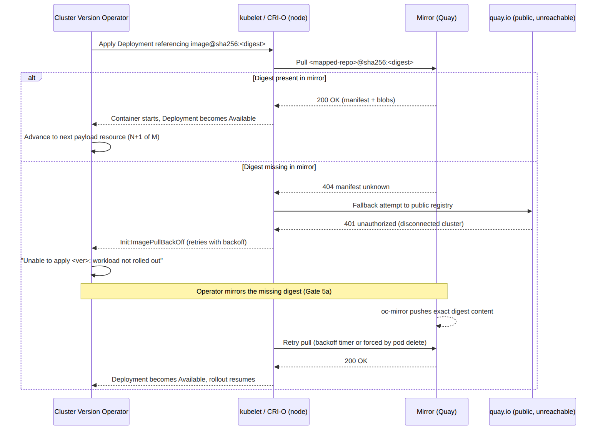

\newpage

# Executive Summary

## Scenario

A Single Node OpenShift (SNO) cluster (`master01`), running **OpenShift
4.18.6**, needed to be upgraded to the latest available **4.18.z** release
(4.18.52 → 4.18.53 at time of writing) entirely inside a **disconnected /
mirrored lab environment**. All container images are served from a local
**Quay registry** (`registry.ocp4.example.com:8443`) that the cluster trusts
through legacy **ImageContentSourcePolicy (ICSP)** objects.

## What happened on cluster #1 (the reference run)

1. Podman on the registry host could not log in to Quay (`x509: certificate
   signed by unknown authority`) because the host's local trust store never
   received the Quay CA chain, even though OpenShift itself already trusted
   it via `additionalTrustedCA`. This was fixed by extracting the intermediate
   + root CA from the `registry-config` ConfigMap and installing it under
   `/etc/pki/ca-trust` and `/etc/containers/certs.d/<registry>:<port>/ca.crt`.
2. A full baseline/warm-up pass confirmed the cluster was healthy (all
   ClusterOperators `Available=True/Progressing=False/Degraded=False`, MCPs
   updated, no NoChannel-related surprises) and inventoried the existing
   mirror configuration (3 ICSPs, no IDMS/ITMS) and the two customer
   operators (MetalLB, LVM Storage) installed from a custom `CatalogSource`.
3. The cluster's channel was set to `stable-4.18`, the CVO calculated the
   graph, and the operator initiated an update **directly to 4.18.52** (the
   next recommended hop from 4.18.6), reaching 7% (69/906 payload
   manifests applied) before stalling.
4. The stall was traced through the CVO logs → ClusterOperator `config` →
   Deployment `openshift-config-operator` → Pod →
   **init container `openshift-api` stuck in `Init:ImagePullBackOff`**.
5. Root cause: the init container needed
   `quay.io/openshift-release-dev/ocp-v4.0-art-dev@sha256:f015c440...`
   (the `cluster-config-api` component of the 4.18.52 payload). The node's
   `registries.conf` correctly redirected that pull to the mirror
   (`registry.ocp4.example.com:8443/openshift/release@sha256:f015c440...`),
   but the mirror registry responded `manifest unknown` — **the 4.18.52
   release content had never been mirrored into Quay**. Direct pulls from
   the public `quay.io` also failed (`unauthorized`), as expected in a
   disconnected environment.
6. `skopeo list-tags` against the mirror confirmed the registry only held
   **4.18.6** release content (`release-images` repo had exactly one tag:
   `4.18.6-x86_64`). This is unambiguous: **the mirror was never refreshed
   for the target release before the upgrade was started.**

The reference conversation ends at the point where the root cause is fully
diagnosed but **before the remediation (mirroring the missing content) was
executed**. This SOP closes that gap and turns the whole exercise into a
repeatable, pre-flighted procedure for cluster #2 (and beyond).

## Goal of this SOP

Give any operator — with **no prior context and no live support** — a
deterministic, checklist-driven path to:

1. Validate every prerequisite **before** touching `ClusterVersion` (this is
   the step cluster #1 skipped: mirror-content validation against the actual
   target digest set).
2. Execute the upgrade with the correct monitoring in place so a stall is
   detected in minutes, not by chance.
3. Diagnose and remediate the specific "mirror is missing a required image"
   failure mode (and other common failure modes) using ready-made scripts
   and manifests instead of ad hoc commands.
4. Validate the cluster and its operators post-upgrade and formally sign off.

## Outcome definition ("Done" criteria)

- `oc get clusterversion version` shows the target version with
  `Available=True`, `Progressing=False`, `Degraded=False`, and history state
  `Completed` (not `Partial`).
- `oc get co` — zero ClusterOperators degraded; all `AVAILABLE=True`.
- `oc get mcp` — all pools `UPDATED=True`, `UPDATING=False`, `DEGRADED=False`.
- `oc get nodes` — node(s) `Ready` (no `SchedulingDisabled`, no `NotReady`).
- MetalLB and LVM Storage operator CSVs report `Succeeded` at a version
  compatible with the new OpenShift release.
- A post-upgrade etcd backup exists.
- The mirror registry content inventory has been re-captured and archived
  for the next upgrade cycle.


\newpage

# Constraints, Knowns, and Unknowns

Use this section to separate facts that are **fixed by the environment**
(constraints), facts that are **already proven from cluster #1** (knowns),
and facts that **must be re-discovered on cluster #2** before proceeding
(unknowns). Do not assume a known from cluster #1 automatically applies to
cluster #2 — always re-verify with the discovery scripts.

## Constraints (cannot be changed, must be designed around)

| # | Constraint | Implication |
|---|---|---|
| C1 | Cluster is **disconnected**: no direct internet egress from nodes | Every image the target release/operators need must exist in the local mirror **before** the upgrade starts |
| C2 | Cluster is **Single Node OpenShift (SNO)**: one node is simultaneously control-plane + worker | During the MCO/RHCOS update step the API server and all workloads become briefly unavailable during the mandatory reboot — there is no second node to fail over to |
| C3 | CVO applies the release payload as an **atomic, ordered DAG** of ~900 resources | A single missing image blocks the whole rollout at that resource; it does not skip ahead |
| C4 | Image references inside a release payload are **digests, not tags** | You cannot "fix" a missing image by mirroring *a* tag; you must mirror the **exact digest set** for the target release |
| C5 | Upgrades can only move along the **official Cincinnati update graph** for the configured channel (e.g., `stable-4.18`) | You cannot arbitrarily jump versions; the graph decides valid hops (e.g. 4.18.6 → 4.18.52, not straight to 4.18.53, if 4.18.53 isn't offered as a direct edge yet) |
| C6 | etcd backup/restore has **limited support on SNO** (no other member to restore to) | Backup is still mandatory for forensics/rebuild, but do not assume a guaranteed in-place restore path |
| C7 | Registry host trust store and OpenShift's cluster-wide trust store (`additionalTrustedCA`) are **independent** | Fixing one does not fix the other; both must be validated |
| C8 | OLM operators must have a **compatible channel/CSV path** for the target OpenShift minor/patch | An operator with no update available for the new OCP version can block or degrade after the platform upgrade |

## Knowns (proven true on cluster #1 — treat as reference, re-verify on #2)

| # | Known fact | Evidence |
|---|---|---|
| K1 | Mirror registry is Quay 3.8.12 behind nginx at `registry.<domain>:8443` | `podman ps`, `curl -I https://…/v2/` → `server: nginx/1.20.1` |
| K2 | Registry TLS chain: leaf → `Red Hat Training Certificate Authority` → `Red Hat Training Trust Services` (root), leaf cert valid until 2029-01-07 | `openssl x509 -issuer -subject` walk of `registry-config` ConfigMap |
| K3 | Cluster trusts the registry via `openshift-config/registry-config` + `image.config.openshift.io/cluster.spec.additionalTrustedCA` | `oc get configmap registry-config -n openshift-config` |
| K4 | Podman/host-level trust is **separate** and was empty by default | `/etc/containers/certs.d/` was empty until manually populated |
| K5 | Cluster mirroring uses **legacy ICSP** (3 objects: `image-policy`, `operator-<ts>`, `release-<ts>`), no IDMS/ITMS present | `oc get imagecontentsourcepolicy,imagedigestmirrorset,imagetagmirrorset` |
| K6 | Two OLM operators matter: **MetalLB Operator** (`metallb-system`, channel `stable`) and **LVM Storage Operator** (`openshift-storage`, channel `stable-4.18`), both from `CatalogSource` `gls-catalog-cs` in `openshift-marketplace` | `oc get subscriptions -A -o wide` |
| K7 | Prior to upgrade, cluster was healthy: all ClusterOperators `Available/​!Progressing/​!Degraded`, MCPs updated, one `Ready` node | Baseline warm-up capture |
| K8 | Channel was **unset** (`spec.channel=""`) pre-upgrade — `RetrievedUpdates=False/NoChannel` | `oc get clusterversion version -o yaml` |
| K9 | Setting `stable-4.18` immediately produced a recommended-update graph and the operator proceeded straight to **4.18.52** | `oc adm upgrade` output after channel patch |
| K10 | Upgrade stalled at CVO payload step **65/906** on `Deployment openshift-config-operator/openshift-config-operator` because its init container `openshift-api` could not pull `quay.io/openshift-release-dev/ocp-v4.0-art-dev@sha256:f015c440...` (component `cluster-config-api`) | `oc describe pod`, CVO logs |
| K11 | The mirror only contained **4.18.6** release content; `skopeo list-tags` against `openshift/release-images` on the mirror returned exactly `4.18.6-x86_64` | Direct skopeo query against registry host |
| K12 | Both the direct Quay pull (`unauthorized`) and the mirror pull (`manifest unknown`) failed for the missing digest — this is the disconnected-cluster signature of "image never mirrored," not a credentials or network problem | kubelet event text + `crictl pull` results |

## Unknowns — must be re-discovered on cluster #2 (never assume)

| # | Unknown | How to discover | Script/Command |
|---|---|---|---|
| U1 | Current OCP version and channel on cluster #2 | Never assume it matches cluster #1 (patch level may differ) | `scripts/00-preflight-check.sh` |
| U2 | Whether cluster #2 uses ICSP, IDMS/ITMS, or a mix | Inventory before touching mirror config | `oc get imagecontentsourcepolicy,imagedigestmirrorset,imagetagmirrorset -o yaml` |
| U3 | Whether the shared mirror registry (if reused from cluster #1) already contains the target release for cluster #2, or needs a fresh mirror pass | `skopeo list-tags` / digest probe against every referenced repo | `scripts/02-inventory-mirror-content.sh` |
| U4 | Exact target version the Cincinnati graph will recommend once the channel is set (may not be the newest GA release if it's not yet a direct edge) | `oc adm upgrade` after setting channel, **before** issuing `--to` | `scripts/03-set-channel-and-check-graph.sh` |
| U5 | Which operators are installed and whether their current channel/CSV has an update path compatible with the target OCP version | `oc get subscriptions -A -o wide`, vendor compatibility matrix | manual + `oc get csv -A` |
| U6 | Registry host trust state (may already be fixed if this is a shared registry, or may be a fresh host) | Re-run the trust validation, do not assume it is already fixed | `scripts/01-registry-trust-setup.sh` |
| U7 | Available local disk/registry storage headroom for a new release's worth of images (was 152 GB used out of an unknown total on cluster #1) | `df -h` on the registry host + Quay storage volume `du` | `scripts/02-inventory-mirror-content.sh` |
| U8 | Whether cluster #2 has any workloads/PVs/pending pods that would make "unhealthy before the upgrade" look like "broken by the upgrade" | `oc get pods -A --field-selector=status.phase!=Running,status.phase!=Succeeded`, `oc get events -A` | `scripts/00-preflight-check.sh` |
| U9 | Network path from cluster #2's nodes to the mirror registry (same registry host? new host? different port/hostname?) | `oc debug node/<node> -- curl -I https://<registry>/v2/` | `scripts/00-preflight-check.sh` |
| U10 | Whether an `oc-mirror` workflow already exists for this environment (imageset config, cache dir, credentials) or must be created from scratch | Check for `~/.oc-mirror`, existing `ImageSetConfiguration` YAMLs, mirror-to-disk archives | manual discovery, then `manifests/imagesetconfig-release.yaml` |

## Decision rule

> **If any Unknown cannot be resolved to a definite, verified answer, treat
> it as a blocking gate.** Do not proceed to the upgrade execution phase
> (`docs/03-SOP-Execution-Flow.md`) until every row in the Pre-Upgrade
> Checklist (`docs/02-SOP-Preupgrade-Checklist.md`) is green.


\newpage

# SOP — Pre-Upgrade Checklist (Categorical Gates)

Work through every category in order. **Each gate must be GREEN before moving
to the next.** Do not skip ahead because "it worked like that on cluster #1."

Legend: 🟢 pass / 🟡 needs attention / 🔴 blocking — do not proceed.

## Gate 0 — Access & tooling

- [ ] `oc` CLI matches (or is newer than) the target OpenShift version.
- [ ] `KUBECONFIG` points at cluster #2, confirmed via
      `oc whoami --show-server`.
- [ ] `podman`, `skopeo`, and (if mirroring is needed) `oc-mirror` are
      installed on the workstation/registry host and their versions are
      recorded.
- [ ] SSH/console access to the registry host and to the SNO node
      (`oc debug node/<node>`) is confirmed working.
- [ ] Run: `bash scripts/00-preflight-check.sh` and attach its output to the
      change record.

## Gate 1 — Cluster baseline health

- [ ] `oc get clusterversion version -o wide` → `AVAILABLE=True`,
      `PROGRESSING=False`.
- [ ] `oc get clusterversion version -o yaml` → condition `Failing=False`.
- [ ] `oc get nodes` → every node `Ready` (no `SchedulingDisabled`/`NotReady`).
- [ ] `oc get clusteroperators` → every operator
      `AVAILABLE=True PROGRESSING=False DEGRADED=False`.
- [ ] `oc get mcp` → every pool `UPDATED=True UPDATING=False DEGRADED=False`.
- [ ] `oc get pods -A --field-selector=status.phase!=Running,status.phase!=Succeeded`
      → empty, or every non-Running pod explained and accepted.
- [ ] `oc get pvc -A` and `oc get pv` reviewed — no unexpected `Pending`/`Lost`.
- [ ] `oc get events -A --sort-by='.lastTimestamp' | tail -50` reviewed for
      pre-existing noise so it isn't confused with upgrade-caused errors later.

> **Do not proceed if the baseline is already unhealthy.** Fix baseline
> issues first; an upgrade will not repair a broken cluster and will make
> troubleshooting far harder.

## Gate 2 — Registry / mirror trust (host level)

This is the exact class of problem that blocked login on cluster #1 (Podman
had no CA trust even though OpenShift did).

- [ ] Extract the CA chain the cluster trusts:
      `oc get configmap registry-config -n openshift-config -o jsonpath='{.data.<key>}' > registry-ca-bundle.pem`
      (the ConfigMap key is the registry host:port with dots/colons escaped,
      e.g. `registry.ocp4.example.com..8443` — **do not rename this key**).
- [ ] Split and identify intermediate/root CA certs
      (`awk` + `openssl x509 -subject -issuer`), confirm the chain terminates
      in a self-signed root.
- [ ] Install the CA chain into the registry host's system trust store
      (`/etc/pki/ca-trust/source/anchors/`, then `update-ca-trust extract`).
- [ ] Install the CA into the Podman/CRI-specific trust directory:
      `/etc/containers/certs.d/<registry-host>:<port>/ca.crt`.
- [ ] Validate with `openssl s_client -CAfile /etc/pki/tls/certs/ca-bundle.crt`
      → `Verify return code: 0 (ok)`.
- [ ] `podman login <registry-host>:<port>` succeeds **without**
      `--tls-verify=false`.
- [ ] From an OpenShift node (`oc debug node/<node> -- chroot /host`),
      `curl -I https://<registry-host>:<port>/v2/` returns `401 Unauthorized`
      (this is the expected "healthy but needs auth" response, not an error).
- [ ] Run: `bash scripts/01-registry-trust-setup.sh` to automate the above and
      record the result.

## Gate 3 — Mirror configuration inventory (cluster side)

- [ ] Inventory existing mirroring objects:
      `oc get imagecontentsourcepolicy,imagedigestmirrorset,imagetagmirrorset -o yaml`.
- [ ] Confirm every `source → mirror` mapping resolves to a registry host that
      is reachable and trusted (Gate 2).
- [ ] Decide: **stay on ICSP** (if that's what's already deployed and
      working) or **migrate to IDMS/ITMS** (Red Hat's recommended mechanism;
      existing ICSPs keep working, so migration is optional, not mandatory,
      for a routine z-stream upgrade). Do not migrate mechanisms in the same
      change window as the version upgrade unless required — it adds an
      independent variable to a rollout you need to be able to reason about.
- [ ] If IDMS/ITMS will be used going forward, stage (but do not yet apply)
      `manifests/idms-openshift-release.yaml` and
      `manifests/idms-operators.yaml`.

## Gate 4 — Update graph / target version

- [ ] Confirm current channel: `oc get clusterversion version -o jsonpath='{.spec.channel}'`.
- [ ] If unset, set the appropriate channel for a disconnected 4.18 cluster:
      `oc patch clusterversion version --type=merge -p '{"spec":{"channel":"stable-4.18"}}'`.
- [ ] Wait for `RetrievedUpdates=True`:
      `oc get clusterversion version -o jsonpath='{.status.conditions[?(@.type=="RetrievedUpdates")].status}'`.
- [ ] Run `oc adm upgrade` and record the **exact recommended version(s)**.
      **Use the version the cluster recommends — never hard-code a version
      number from a previous run or from documentation.**
- [ ] Record the target release digest:
      `oc adm upgrade` output, or
      `oc get clusterversion version -o jsonpath='{.status.availableUpdates}'`.
- [ ] Run: `bash scripts/03-set-channel-and-check-graph.sh` and archive the
      output (this becomes your authoritative target-version record for the
      rest of the change).

## Gate 5 — Mirror **content** validation against the exact target digest set ⚠️ (This gate was skipped on cluster #1 and caused the stall)

This is the single most important gate in this entire SOP.

- [ ] Obtain the target release image reference (digest) from Gate 4.
- [ ] `oc adm release info <target-release-pullspec>` from a host that can
      reach the mirror (or `quay.io` if briefly reachable) to enumerate every
      component image digest in the payload (typically 750+ images).
- [ ] For **every** component digest, verify it resolves through the mirror:
      `skopeo inspect docker://<mirror-host>:<port>/<mapped-repo>@<digest>`.
      Do **not** rely on tag listings (`skopeo list-tags`) alone — release
      payloads pin digests, and a repo can have tags for one version while
      missing digests for another.
- [ ] Automate this with `scripts/02-inventory-mirror-content.sh
      --release <target-pullspec>` which diffs the full digest list from
      `oc adm release info` against what actually resolves on the mirror and
      prints a pass/fail per image.
- [ ] If **any** digest is missing (this is exactly what happened on cluster
      #1 — the mirror only had 4.18.6 content, not 4.18.52), **stop** and
      run the mirroring procedure in Gate 5a before touching `ClusterVersion`.
- [ ] Also validate the operator catalog/bundle images for MetalLB and LVM
      Storage (and any other installed operator) are present for the
      target-compatible channel, using the same digest-resolution method
      against their ICSP/IDMS mirror mappings.
- [ ] Confirm registry storage headroom: a full 4.18 release plus operator
      indexes is commonly 150–250 GB; confirm free space before mirroring
      (`df -h` on the Quay storage volume mount).

### Gate 5a — Mirror the target release (only if Gate 5 found gaps)

- [ ] Build (or reuse) an `oc-mirror` v2 `ImageSetConfiguration` for the
      exact target release — see `manifests/imagesetconfig-release.yaml`.
- [ ] Run `scripts/04-mirror-missing-release-images.sh` (wraps
      `oc mirror -c imagesetconfig-release.yaml --workspace file://<dir>
      docker://<mirror-host>:<port>` in mirror-to-mirror or mirror-to-disk
      mode as appropriate for this environment's connectivity).
- [ ] Apply the IDMS/ITMS (or updated ICSP) that `oc-mirror` generates —
      review the generated manifests before applying; do not blindly
      `oc apply -f` without diffing against the existing mirror config from
      Gate 3.
- [ ] Re-run Gate 5's digest-resolution check until it is 100% green.

## Gate 6 — Operator compatibility

- [ ] `oc get subscriptions -A -o wide`, `oc get csv -A`,
      `oc get catalogsource -A`.
- [ ] For MetalLB Operator and LVM Storage Operator (and any others), confirm
      the subscribed channel has an available CSV that is compatible with
      the target OpenShift version (check vendor release notes / OperatorHub
      compatibility matrix — do this manually, it is not automatable from
      inside a disconnected cluster).
- [ ] Confirm the `CatalogSource` (e.g. `gls-catalog-cs`) itself is mirrored
      for the target index version if a catalog update is also required.
- [ ] If any operator has no compatible path, decide and document whether to
      (a) update the operator first, (b) accept a temporary compatibility
      gap the vendor documents as safe, or (c) hold the platform upgrade.

## Gate 7 — Backup & rollback readiness

- [ ] Confirm `cluster-backup.sh` exists on the control-plane node:
      `oc debug --as-root node/<node> -- chroot /host ls -l /usr/local/bin/cluster-backup.sh`.
- [ ] Take a fresh etcd backup **immediately before** starting the upgrade
      (not days before): `scripts/09-etcd-backup.sh`.
- [ ] Copy the backup off-node (to the workstation or a separate backup
      target) — a backup that lives only on the node you are about to
      upgrade is not a backup.
- [ ] Document the current version/digest (`oc get clusterversion -o
      jsonpath='{.status.history[0]}'`) as the rollback reference point.
- [ ] Confirm you understand SNO restore limitations (Constraint C6): the
      backup exists for forensics and potential reinstall-and-restore, not
      necessarily a fast in-place rollback. Treat "prevent the failure" (Gates
      0–6) as far higher leverage than "recover from the failure" on SNO.

## Sign-off

| Gate | Owner | Result | Timestamp | Notes |
|---|---|---|---|---|
| 0 Access & tooling | | | | |
| 1 Baseline health | | | | |
| 2 Registry trust | | | | |
| 3 Mirror config inventory | | | | |
| 4 Update graph/target | | | | |
| 5 Mirror content validation | | | | |
| 6 Operator compatibility | | | | |
| 7 Backup & rollback readiness | | | | |

**Do not start `docs/03-SOP-Execution-Flow.md` until every row above is
green.**


\newpage

# SOP — Upgrade Execution Flow (During the Upgrade)

Prerequisite: every gate in `docs/02-SOP-Preupgrade-Checklist.md` is green.

## Step 1 — Final go/no-go

- [ ] Re-run `oc get clusterversion,co,mcp,nodes` one last time immediately
      before starting. Nothing should have drifted since Gate 1.
- [ ] Confirm no other change window (network, storage, catalog) is active
      concurrently.
- [ ] Announce the maintenance window: on SNO, the API and console **will**
      be briefly unavailable during the mandatory reboot. This is expected,
      not a failure — see Constraint C2.

## Step 2 — Open the monitoring layout

Open five terminals (or five `tmux` panes) before issuing the upgrade
command, so you observe the very first status change instead of discovering
it minutes later:

| Pane | Command |
|---|---|
| 1 — CVO overall | `watch -n 5 'oc get clusterversion version'` |
| 2 — Operators | `watch -n 5 'oc get clusteroperators'` |
| 3 — Nodes/MCP | `watch -n 5 'oc get nodes; echo; oc get mcp'` |
| 4 — CVO logs | `oc logs -n openshift-cluster-version deployment/cluster-version-operator -f` |
| 5 — Cluster-wide events | `watch -n 5 "oc get events -A --sort-by='.lastTimestamp' | tail -40"` |

Or run `bash scripts/06-monitor-upgrade.sh` which tails the same signals in a
single consolidated loop suitable for a screen log/transcript.

## Step 3 — Issue the upgrade

Only use the version the cluster itself recommends (from Gate 4):

```bash
# If the channel isn't already set:
oc patch clusterversion version --type=merge -p '{"spec":{"channel":"stable-4.18"}}'

# Wait for the graph, then read the recommended version:
oc adm upgrade

# Start the upgrade using the *reported* version — do not hard-code one:
oc adm upgrade --to=<version-reported-by-oc-adm-upgrade>
```

- [ ] Confirm `oc get clusterversion version` immediately shows
      `PROGRESSING=True` with a `Working towards <target>: N of M done`
      message.

## Step 4 — Do **not** intervene on expected automation

The CVO and Machine Config Operator own node disruption end-to-end. **Do
not** run any of the following during a normal rollout:

```
oc adm cordon <node>
oc adm drain <node>
oc delete pod ...          # for CVO/operator-managed pods
oc rollout restart ...
```

Expected, non-alarming transient states:

- ClusterOperators flipping to `PROGRESSING=True` one at a time.
- The node showing `Ready,SchedulingDisabled` while the Machine Config
  Daemon applies the new RHCOS content.
- On SNO specifically: the node going `NotReady` and the API/console
  disappearing entirely during the reboot. This can last several minutes.
  Do not power-cycle, do not re-run `oc adm upgrade`, do not restart the CVO.

## Step 5 — Recognize a genuine stall vs. normal progress

| Signal | Normal | Investigate |
|---|---|---|
| `done/total` counter | Increases over time (sometimes appears to dip slightly as sync loop reconciles — not a rollback) | Frozen for > 15–20 minutes with an explicit error message |
| `oc get clusterversion` message | `Working towards <target>: N of M done, waiting on <component>` | `Unable to apply <target>: the workload <ns>/<name> has not yet successfully rolled out` (this is the exact message from cluster #1) |
| ClusterOperator | Temporarily `Progressing=True` | `Degraded=True` for an extended period, or `Available=False` |
| Node | `Ready,SchedulingDisabled` or briefly `NotReady` during reboot | `NotReady` for far longer than a normal reboot with no kubelet recovery |
| Pod | `Pending`/`ContainerCreating` briefly | `ImagePullBackOff`, `CrashLoopBackOff`, `Init:...BackOff` |

If you land in the "investigate" column, **stop watching and switch to**
`docs/05-Troubleshooting-Guide.md` — the exact `ImagePullBackOff` scenario
from cluster #1 is documented there with the full command sequence.

## Step 6 — If the upgrade stalls on a missing mirrored image

This is the scenario that happened on cluster #1. Do not treat it as an
operator bug — it is a mirror-content gap, and it is fixable without support:

1. Identify the failing pod/deployment/namespace from the CVO message.
2. `oc describe pod -n <ns> <pod>` → find the exact image digest in
   `ImagePullBackOff` events.
3. Confirm the digest is genuinely absent from the mirror (not a transient
   network blip): `scripts/07-diagnose-image-pull-failure.sh <digest>`.
4. If confirmed absent, mirror it: re-run Gate 5a
   (`scripts/04-mirror-missing-release-images.sh`) targeting the **same
   release digest** the CVO is currently applying (read it from
   `oc get clusterversion version -o jsonpath='{.status.desired.image}'`).
5. **Do not delete the stuck pod repeatedly hoping it retries faster** — the
   kubelet already retries with backoff, and CVO reconciles automatically
   once the image becomes pullable. Fix the mirror; let the existing backoff
   loop pick it up (usually within 1–5 minutes of the mirror becoming
   correct), or delete the pod **once** after the mirror is fixed to force
   an immediate retry instead of waiting out the backoff timer.
6. Resume monitoring from Step 2. Do not restart the CVO deployment.

## Step 7 — Completion criteria

- [ ] `oc get clusterversion version` shows the target version with
      `AVAILABLE=True`, `PROGRESSING=False`.
- [ ] `oc get clusterversion version -o jsonpath='{.status.history[0].state}'`
      returns `Completed` (not `Partial`).
- [ ] `oc get co` — zero operators degraded, all available.
- [ ] `oc get mcp` — all pools updated, not updating, not degraded.
- [ ] `oc get nodes` — all `Ready`.

Proceed to `docs/04-SOP-Postupgrade-Validation.md`.

## What to capture for the record (every run)

- Full transcript of the five monitoring panes (or the consolidated
  `06-monitor-upgrade.sh` log) from start to completion.
- `oc adm upgrade` output at the moment the target was chosen.
- `oc get clusterversion version -o yaml` at completion.
- Any stall episode: the exact error message, the digest involved, the fix
  applied, and the time-to-resolution.


\newpage

# SOP — Post-Upgrade Validation & Sign-off

Run `bash scripts/08-post-upgrade-validate.sh` to automate the checks below,
then complete the manual review items.

## Category A — Platform version & health

- [ ] `oc get clusterversion version -o wide` shows target version,
      `AVAILABLE=True`, `PROGRESSING=False`.
- [ ] `oc get clusterversion version -o jsonpath='{range .status.history[*]}{.version}{" | "}{.state}{"\n"}{end}'`
      shows the new version with state `Completed`.
- [ ] `oc get co` — all `AVAILABLE=True PROGRESSING=False DEGRADED=False`.
- [ ] `oc get mcp` — all pools `UPDATED=True UPDATING=False DEGRADED=False`,
      and `MACHINECOUNT == READYMACHINECOUNT == UPDATEDMACHINECOUNT`.
- [ ] `oc get nodes -o wide` — node(s) `Ready`, kernel/OS image reflects the
      new RHCOS build, kubelet version matches the new Kubernetes version
      shipped with the target OpenShift release.

## Category B — Workload health

- [ ] `oc get pods -A --field-selector=status.phase!=Running,status.phase!=Succeeded`
      is empty (or every entry is understood/expected, e.g. `Completed`
      Jobs).
- [ ] `oc get events -A --sort-by='.lastTimestamp' | tail -50` shows no
      recurring `Warning` events tied to the new version.
- [ ] Application/ingress smoke test: hit a representative Route via the
      MetalLB-provisioned LoadBalancer IP and confirm a 200-class response.
- [ ] PVC/PV state unchanged from pre-upgrade baseline (`oc get pvc -A`,
      `oc get pv`).

## Category C — Operator/OLM health

- [ ] `oc get csv -A` — MetalLB Operator and LVM Storage Operator (and any
      others) report `Succeeded` at the expected version.
- [ ] `oc get subscriptions -A -o wide` — no subscription stuck in
      `UpgradePending`/`UpgradeFailed`.
- [ ] Functional check: MetalLB `L2Advertisement`/`IPAddressPool` still
      active and an example `Service type=LoadBalancer` still has an
      external IP; LVM Storage `LVMCluster` is `Ready` and a test PVC still
      binds.

## Category D — Disconnected registry / mirror hygiene

- [ ] Re-capture the mirror content inventory
      (`scripts/02-inventory-mirror-content.sh`) and archive it alongside
      this run's change record — this becomes next cycle's "known good"
      baseline.
- [ ] Confirm registry storage headroom after the mirror pass (should have
      grown by roughly one release's worth of images; note the new total).
- [ ] Confirm no orphaned `oc-mirror` cache/workspace directories are left
      filling disk on the workstation/registry host.

## Category E — Backup & documentation

- [ ] Take a **post-upgrade** etcd backup and store it alongside the
      pre-upgrade one (`scripts/09-etcd-backup.sh`).
- [ ] Update the cluster's version/digest record used for rollback reference.
- [ ] File the completed sign-off table (Gate table from the pre-upgrade
      checklist, plus this document's checkboxes) in the change ticket.
- [ ] Note any deviation from this SOP (what happened, what was done
      differently, why) so the SOP can be improved for the next cluster.

## Sign-off

| Category | Result | Verified by | Timestamp |
|---|---|---|---|
| A — Platform version & health | | | |
| B — Workload health | | | |
| C — Operator/OLM health | | | |
| D — Registry/mirror hygiene | | | |
| E — Backup & documentation | | | |

**Upgrade is only considered complete once all five categories are signed
off.**


\newpage

# Troubleshooting Guide

## 1. Multi-layer diagnostic matrix

Use this table to decide which command to run next, based on which layer is
implicated. This is the general-purpose map; the specific scenario cluster
#1 hit is expanded in Section 3.

| Layer | Command | What it tells you |
|---|---|---|
| CVO (overall) | `oc get clusterversion` | Overall upgrade state/percentage |
| CVO (detail) | `oc describe clusterversion version` | Conditions, history, explicit error text |
| CVO logs | `oc logs -n openshift-cluster-version deploy/cluster-version-operator -f` | Which payload resource is being applied/blocked |
| ClusterOperators | `oc get co` | Per-operator health |
| Specific operator's pods | `oc get pods -n <operator-namespace>` | Workload rollout state |
| Pod detail | `oc describe pod -n <ns> <pod>` | Scheduling / image-pull / startup failure with events |
| Deployment/ReplicaSet | `oc describe deployment / rs -n <ns> <name>` | Rollout math (desired/updated/available replicas) |
| Cluster-wide events | `oc get events -A --sort-by='.lastTimestamp'` | Chronological signal across all namespaces |
| Node-specific events | `oc get events -A --field-selector involvedObject.name=<node>` | Node-scoped issues (disk, kubelet, drain) |
| Node/MCP | `oc get nodes`, `oc get mcp`, `oc describe mcp <pool>` | RHCOS/MachineConfig rollout |
| Machine Config Daemon | `oc logs -n openshift-machine-config-operator <mcd-pod>` | Drain/cordon/pivot/reboot/uncordon sequence |
| CRI (node-local) | `oc debug node/<n> -- chroot /host crictl images --digests` | What's actually cached on the node |
| CRI pull test | `oc debug node/<n> -- chroot /host crictl pull <ref>` | Direct pull attempt with full error text |
| Registry-side | `skopeo inspect docker://<mirror>/<repo>@<digest>` | Whether the mirror actually has that manifest |
| Registry logs | `podman logs <quay-container>` / `podman logs <nginx-container>` | Server-side view of the same requests |
| Network/TLS | `curl -vk https://<registry>/v2/` (from node and from registry host) | Reachability + certificate chain |
| Mirror config | `oc get imagedigestmirrorset,imagecontentsourcepolicy,imagetagmirrorset -o yaml` | Cluster-side source→mirror mapping |
| Node mirror config | `oc debug node/<n> -- chroot /host cat /etc/containers/registries.conf` | The rendered, effective mirror config on the node |
| Release payload | `oc adm release info <pullspec>` / `--image-for=<component>` | Ground truth for which digest a component maps to |

### Reading order for "the upgrade seems stuck"

```
oc get clusterversion            (is it Progressing, and what does the message say?)
      ↓
oc get co                        (which operator is Progressing/Degraded?)
      ↓
oc get pods -n <that operator's namespace>
      ↓
oc describe pod -n <ns> <pod>    (Events section — this is your "log" when a
                                   container never started)
      ↓
classify: scheduling | image pull | crashloop | readiness/liveness | other
```

## 2. Common failure classes and first response

| Symptom | Likely class | First response |
|---|---|---|
| `x509: certificate signed by unknown authority` on `podman login` | Host-level trust store missing the mirror's CA | Gate 2 procedure — extract CA from `registry-config`, install into `/etc/pki/ca-trust` and `/etc/containers/certs.d/<host>:<port>/` |
| `oc adm upgrade` says `NoChannel` / `Cannot display available updates` | Channel not set | Set `spec.channel` to the correct channel, wait for `RetrievedUpdates=True` |
| `oc adm upgrade --to=<X>` rejected / X not offered | X is not a valid edge from the current version in the current channel | Use the version(s) actually listed by `oc adm upgrade`; do not force an arbitrary version |
| CVO message: `Unable to apply <ver>: the workload <ns>/<name> has not yet successfully rolled out` | A payload Deployment can't reach minimum availability | Inspect the pod for that Deployment — almost always an image-pull or scheduling issue, see Section 3 |
| Pod stuck `Init:ImagePullBackOff` / `ErrImagePull` | Missing image, wrong mirror mapping, or registry auth failure | See Section 3 — determine which of the three with `skopeo inspect` + `crictl pull` |
| `manifest unknown` from the mirror | The mirror registry does not have that digest | The image was never mirrored for this release — mirror it (Gate 5a) |
| `unauthorized: access to the requested resource is not authorized` from `quay.io` directly | Expected in a disconnected cluster reaching the public registry — not itself the root cause | Check the **mirror** response, not the public registry response |
| Node shows `NotReady` for an extended period mid-upgrade | Reboot in progress (expected, briefly) vs. genuine boot failure | Give it the time budgeted for a normal reboot (~10–15 min); if it exceeds that, get console/BMC access to the node |
| ClusterOperator `Degraded=True` persists > 30 min | Underlying resource (secret, cert, PVC, quota) blocking the operator's controller | `oc describe co <name>`, then follow its `relatedObjects` |
| Operator (MetalLB/LVM) CSV stuck `Pending`/`Installing` after platform upgrade | Catalog/bundle images not mirrored for the new index, or no compatible channel | Re-check Gate 6; mirror the updated catalog if needed |
| `skopeo list-tags` shows old tags only (e.g. only `4.18.6-x86_64`) | Mirror was never refreshed for the new target version | This is the cluster #1 root cause — proceed to Gate 5a mirroring |

## 3. Deep dive — the exact cluster #1 scenario: `ImagePullBackOff` on `openshift-config-operator` during CVO rollout

### Symptom chain (in the order it was observed)

1. `oc get clusterversion version` →
   `Working towards 4.18.52: 69 of 906 done (7% complete), waiting on config-operator`
2. A few minutes later:
   `Unable to apply 4.18.52: the workload openshift-config-operator/openshift-config-operator has not yet successfully rolled out`
3. `oc get pods -n openshift-config-operator` →
   `openshift-config-operator-<hash> 0/1 Init:ImagePullBackOff`
4. `oc describe pod -n openshift-config-operator <pod>` → Events:
   ```
   Failed to pull image "quay.io/openshift-release-dev/ocp-v4.0-art-dev@sha256:f015c440...":
   initializing source docker://...: (Mirrors also failed:
   [registry.<mirror>:8443/openshift/release@sha256:f015c440...:
   reading manifest sha256:f015c440... in registry.<mirror>:8443/openshift/release:
   manifest unknown]):
   ...: unauthorized: access to the requested resource is not authorized
   ```

### Diagnostic sequence used (reusable verbatim on cluster #2)

```bash
# 1. Confirm the exact failing digest and which init container needs it
oc get pod -n openshift-config-operator <pod> \
  -o jsonpath='{range .spec.initContainers[*]}{.name}{" => "}{.image}{"\n"}{end}'

# 2. Confirm it is genuinely absent from the mirror, not a fluke
skopeo inspect docker://<mirror-host>:<port>/openshift/release@sha256:<digest>
#   -> "manifest unknown"  means: not in the mirror at all

# 3. Confirm the node's rendered mirror mapping is what you expect
oc debug node/<node> -- chroot /host cat /etc/containers/registries.conf

# 4. Confirm the node genuinely cannot pull it either way
oc debug node/<node> -- chroot /host \
  crictl pull quay.io/openshift-release-dev/ocp-v4.0-art-dev@sha256:<digest>
oc debug node/<node> -- chroot /host \
  crictl pull <mirror-host>:<port>/openshift/release@sha256:<digest>

# 5. Identify which release component that digest belongs to (for the record)
oc adm release info <target-release-pullspec> | grep -i config
oc adm release info <target-release-pullspec> --image-for=cluster-config-operator
```

### Root cause

The mirror registry had only ever been populated with the **4.18.6** release
content (confirmed via `skopeo list-tags` returning a single
`4.18.6-x86_64` tag on `openshift/release-images`). The 4.18.52 payload
requires dozens of new/changed component digests (in this case,
`cluster-config-api`) that simply do not exist yet in the local Quay. This is
**not** a certificate problem (TLS/auth to the mirror already worked), not a
DNS/network problem (the mirror answered with a valid, well-formed `401`/
`manifest unknown`), and not an OpenShift bug — it is a **stale mirror**.

### Fix

1. Read the exact digest the CVO is currently applying:
   `oc get clusterversion version -o jsonpath='{.status.desired.image}'`.
2. Build/obtain an `ImageSetConfiguration` for that exact release (see
   `manifests/imagesetconfig-release.yaml`), pointed at `channels: - name:
   stable-4.18 minVersion: <target> maxVersion: <target>` (or a small range
   spanning the hop) so `oc-mirror` fetches the full digest closure for that
   payload plus its referenced component images.
3. Run `scripts/04-mirror-missing-release-images.sh` to execute the mirror.
4. Do **not** manually retag or fabricate an image at that digest — the
   digest is a cryptographic hash of the real content; only the genuine
   image will satisfy it.
5. Once mirrored, the kubelet's existing backoff loop will succeed on its
   next retry, or delete the stuck pod once to force an immediate retry.
   The CVO will then resume the payload apply from where it left off — you
   do **not** need to restart the upgrade from scratch.

### What NOT to do (all confirmed anti-patterns from this scenario)

- Do not repeatedly `oc delete pod` hoping the image magically appears —
  fix the mirror first.
- Do not cordon/drain the node manually — this isn't a scheduling problem
  and the CVO/MCO own that lifecycle.
- Do not edit `/etc/containers/registries.conf` on the node by hand — it is
  machine-config-managed and will be reconciled back (or drift silently).
- Do not restart the CVO deployment or edit `ClusterVersion.status` — it is
  correctly waiting; it needs the environment fixed, not itself fixed.
- Do not add `--tls-verify=false` to work around trust issues — fix the
  actual CA trust (Gate 2) instead; TLS bypass will mask the next real
  problem too.
- Do not assume `crictl images` showing many `ocp-v4.0-art-dev` images means
  the required digest is present — release payloads pin exact digests;
  "similar" images are not equivalent.

## 4. Escalation-free decision tree

```
Upgrade not progressing?
├─ Is `oc get clusterversion` Progressing=True with an increasing counter?
│   └─ YES → normal, keep watching (Section "Recognize a genuine stall")
├─ Is the message "Unable to apply <ver>: workload <ns>/<name> not rolled out"?
│   └─ YES → oc get pods -n <ns>; classify pod state
│       ├─ Init:ImagePullBackOff / ErrImagePull → Section 3 flow
│       ├─ CrashLoopBackOff → oc logs <pod> --previous; check config/secret
│       ├─ Pending (unscheduled) → oc describe pod; check taints/resources
│       └─ Running but NotReady → check readiness probe / dependent service
├─ Is a ClusterOperator Degraded=True?
│   └─ YES → oc describe co <name>; walk relatedObjects
├─ Is a node NotReady beyond a normal reboot window?
│   └─ YES → console/BMC access; check kubelet/crio service status on node
└─ None of the above → capture `oc adm must-gather` and the CVO log window
    around the stall before making any further changes
```


\newpage

# Mind Map & Diagrams

All diagrams are provided twice: as **Mermaid** (renders natively on GitHub,
GitLab, VS Code, Obsidian, etc.) and as **ASCII** (renders anywhere,
including inside the exported Word document and plain terminals). The
Mermaid source files also live standalone under `diagrams/*.mmd`.

## 1. Mind map — the whole upgrade problem space





### ASCII equivalent

```
                              Disconnected SNO 4.18 Upgrade
                                          |
     -------------------------------------------------------------------------
     |            |            |            |            |          |       |
Constraints    Trust        Mirror      UpdateGraph   Operators  Execution Validation
  |               |            |            |            |          |       |
 no egress    cluster trust  ICSP/IDMS    channel      MetalLB   baseline  CVO=Completed
 SNO=1 node   host trust     oc-mirror    RetrievedUpd  LVM       monitor   CO healthy
 ordered DAG  TLS chain      digest check never-hardcode CatalogSrc expected  MCP updated
 digest pin                  storage cap  target ver    channel   automation ops Succeeded
 graph hops                                             compat    stall-detect backup
 SNO restore
 limited
```

## 2. Execution flow (flowchart)




### ASCII equivalent (condensed)

```
[Gate 0-1: access+baseline] --fail--> fix, loop back
        | pass
[Gate 2: registry/host trust] --fail--> extract CA, install, loop back
        | pass
[Gate 3: mirror inventory] --fail--> classify ICSP/IDMS, loop back
        | pass
[Gate 4: channel + graph] --fail--> set channel, wait, loop back
        | pass
[Gate 5: mirror content == target digests] --fail--> Gate5a oc-mirror, loop back
        | pass
[Gate 6: operator compatibility] --fail--> update/accept/hold, loop back
        | pass
[Gate 7: fresh etcd backup] --fail--> take backup, loop back
        | pass
[Open monitoring] -> [oc adm upgrade --to=<recommended>]
        |
   progressing? --stalled--> Troubleshooting decision tree
        |                          |
        |                    missing image? --yes--> mirror it, resume
   reached target? --no--> back to troubleshooting
        | yes
[Post-upgrade validation A-E] -> [Sign-off] -> DONE
```

## 3. Logical / architecture diagram — disconnected mirror path




### ASCII equivalent

```
 Workstation                     Registry Host                          (unreachable)
+-----------------+   login/    +--------------------------+   images   +----------------+
| oc / oc-mirror / |--push----->| nginx:8443 -> Quay 3.8.x  |<-- staged--| quay.io /       |
| skopeo            |           |   |                        |  from    | registry.redhat |
+-----------------+             |   v                        |  here    | .io             |
                                 | blob storage (sha256/*)   |          +----------------+
                                 | certs.d/ca.crt (Podman)   |
                                 | /etc/pki/ca-trust (system)|
                                 +--------------------------+
                                            ^
                                            | pull-from-mirror = digest-only
                                            |
                              +-------------------------------+
                              | SNO node (master01)            |
                              | CVO -> kubelet/CRI-O           |
                              | registries.conf (rendered      |
                              |   from ICSP / IDMS / ITMS)     |
                              +-------------------------------+
```

## 4. Sequence diagram — image pull during CVO rollout (success vs. failure path)





## Notes on rendering these diagrams

- GitHub, GitLab, Obsidian, and recent VS Code render Mermaid fenced blocks
  automatically.
- To render standalone images (PNG/SVG) for a slide deck, use
  [`@mermaid-js/mermaid-cli`](https://github.com/mermaid-js/mermaid-cli):

  ```bash
  npx -y @mermaid-js/mermaid-cli -i diagrams/execution-flow.mmd -o diagrams/execution-flow.svg
  ```
- The `.mmd` sources for each diagram above are saved individually under
  `diagrams/` for exactly this purpose.


\newpage

# Best Practices — Disconnected OpenShift SNO Upgrades

## Planning

1. **Validate mirror content against the exact target digest set before you
   touch `ClusterVersion`.** This single practice would have prevented the
   cluster #1 stall entirely. Tag-level checks (`skopeo list-tags`) are not
   sufficient; release payloads pin digests.
2. **Let the cluster's own update graph choose the target version.** Never
   hard-code a version from documentation or from a previous run — Cincinnati
   graphs change, and a version that was a direct edge yesterday may not be
   today (and vice versa).
3. **Treat channel changes and mirroring-mechanism migrations (ICSP→IDMS) as
   separate changes from the version upgrade** unless there's a specific
   reason to combine them. Fewer simultaneous variables makes root-causing a
   stall far faster.
4. **Capture a full baseline before starting** (ClusterVersion, CO, MCP,
   nodes, events, PVC/PV) so that upgrade-time troubleshooting can
   distinguish "caused by the upgrade" from "was already like that."
5. **Right-size registry storage ahead of time.** A full 4.18 release plus
   operator catalogs is commonly 150–250 GB; check headroom before mirroring,
   not after it fails partway through.

## Trust & security

6. **Keep host-level container trust (`/etc/containers/certs.d`) and
   cluster-level trust (`additionalTrustedCA`) in sync deliberately** — they
   are independent stores and one being correct does not imply the other is.
7. **Never use `--tls-verify=false` / `-k` as a permanent fix.** It's fine as
   a *diagnostic* step to isolate whether a failure is TLS-related, but the
   durable fix is always to install the correct CA chain.
8. **Prefer installing the intermediate + root CA, not the leaf certificate,**
   into trust stores — the leaf changes on renewal, the CA chain is stable
   for years.

## Mirroring

9. **Use `oc-mirror` v2 with an `ImageSetConfiguration` scoped to the release
   range you actually need** (e.g. `minVersion`/`maxVersion` bracketing the
   current and target versions) rather than mirroring entire channels
   unnecessarily — this saves enormous time and storage on repeat upgrades.
10. **Review generated IDMS/ITMS/ICSP manifests before applying them.** Diff
    against what's already on the cluster; don't blindly overwrite an
    existing, working mirror configuration.
11. **Keep a per-release archive of what you mirrored** (imageset config +
    resulting digest list) so the next upgrade's Gate 5 check has a fast,
    authoritative "known good" baseline to diff against.
12. **Prefer digest-only mirroring (`pull-from-mirror = "digest-only"`)** for
    release/operator content, matching what OpenShift itself expects — this
    is what was already correctly configured on cluster #1's node-level
    `registries.conf`.

## Execution

13. **Always open the multi-pane monitoring layout before issuing the
    upgrade command**, not after something looks wrong — you want to see the
    first status transition, not reconstruct it after the fact.
14. **Distinguish "expected disruption" from "stall."** On SNO in particular,
    a temporary `NotReady` node and unreachable API during the mandatory
    reboot are normal; treat only a stall with an explicit blocking message
    (or a reboot that exceeds a sane time budget) as actionable.
15. **Let CVO/MCO own node lifecycle.** Never manually cordon, drain, delete
    CVO-managed pods repeatedly, or restart the CVO deployment during a
    normal rollout — these actions do not address the underlying blocker and
    can complicate reconciliation.
16. **When a stall is fixed by mirroring a missing image, let the existing
    retry/backoff resume the rollout** (or do at most one forced pod delete)
    rather than restarting the upgrade end-to-end.

## Operators & workloads

17. **Check operator update compatibility (channel/CSV) against the target
    OpenShift version before the platform upgrade**, not after — a
    platform-level upgrade can leave an operator with no valid path forward
    if this isn't checked in advance.
18. **Mirror updated catalog/bundle images together with the platform
    release** if the operator's compatible version requires a newer index —
    don't assume the existing catalog mirror will happen to already contain
    it.

## Backup & change management

19. **Take the etcd backup immediately before starting**, not "recently" —
    and copy it off-node. A backup that only exists on the node you are
    about to upgrade is not a backup.
20. **On SNO, weight prevention over recovery.** Restore options are limited
    with a single member; the pre-upgrade gates in this SOP are your primary
    risk control, not the backup.
21. **Record every deviation from the SOP** (what was different, why, what
    happened) and feed it back into the SOP before the next cluster — this
    is how a one-off troubleshooting session becomes an organizational
    capability instead of tribal knowledge.

## Communication & auditability

22. **Timestamp everything** (gate sign-offs, stall start/end, remediation
    actions) — post-incident review is far easier with a timeline than with
    "it took a while and then it worked."
23. **Never run an unfamiliar command against a live CVO rollout "to see what
    happens."** Every corrective action in this kit was chosen because it is
    non-destructive and reversible; ad hoc commands against a mid-rollout
    cluster are the highest-risk category of action in this entire
    procedure.


\newpage

# Failure Cases Catalog

Each entry: **Trigger → Symptom → Root cause → Remediation → Prevention**.

## FC-1 — Podman cannot log in to the mirror (`x509: certificate signed by unknown authority`)

- **Trigger:** Fresh registry host, or host trust store never populated.
- **Symptom:** `podman login <registry>:<port>` fails with an x509 error,
  even though `oc get configmap registry-config -n openshift-config` shows
  a valid, cluster-trusted CA chain.
- **Root cause:** OpenShift's `additionalTrustedCA` and the registry host's
  OS/Podman trust stores are independent. The cluster trusting the registry
  does not mean the registry *host itself* trusts its own certificate chain
  from Podman's point of view.
- **Remediation:** Extract the CA chain from `registry-config`, identify the
  intermediate/root certs via `openssl x509 -subject -issuer`, install into
  `/etc/pki/ca-trust/source/anchors/` + `update-ca-trust extract`, and into
  `/etc/containers/certs.d/<host>:<port>/ca.crt`. Re-test with
  `openssl s_client -CAfile ...` before retrying `podman login`.
- **Prevention:** Bake CA installation into registry-host provisioning
  automation; include it in Gate 2 of every upgrade cycle regardless of
  whether it "should" already be fixed.

## FC-2 — `oc adm upgrade` reports `NoChannel` and no available updates

- **Trigger:** `spec.channel` was never set (common on freshly installed
  disconnected clusters).
- **Symptom:** `RetrievedUpdates=False`, reason `NoChannel`; `availableUpdates`
  is `null`.
- **Root cause:** The CVO cannot calculate a graph without a channel; an
  empty channel is valid for restricted clusters that don't use the public
  recommendation service, but it means you must explicitly opt in.
- **Remediation:** `oc patch clusterversion version --type=merge -p
  '{"spec":{"channel":"stable-4.18"}}'`, then wait for
  `RetrievedUpdates=True`.
- **Prevention:** Document the intended channel per cluster as part of its
  build record so this isn't rediscovered ad hoc during every upgrade.

## FC-3 — CVO stalls with `Unable to apply <ver>: workload not rolled out` / `ImagePullBackOff` on a payload component (the cluster #1 incident)

- **Trigger:** Target release was never (fully) mirrored into the local
  registry before the upgrade was started.
- **Symptom:** Progress counter freezes (e.g. `65/906` or `69/906`); a
  specific ClusterOperator's Deployment pod is stuck
  `Init:<container>:ImagePullBackOff`; kubelet events show
  `manifest unknown` from the mirror and `unauthorized` from the public
  registry for the same digest.
- **Root cause:** The mirror registry's content lagged the release the CVO
  was told to install; the release payload requires an exact digest set,
  and even one missing digest blocks that payload resource from completing.
- **Remediation:** Identify the exact digest and target release
  (`oc get clusterversion version -o jsonpath='{.status.desired.image}'`),
  build/run an `ImageSetConfiguration` for that release, mirror it with
  `oc-mirror`, and let the kubelet/CVO retry loop resume automatically (or
  force one pod deletion). Full sequence in
  `docs/05-Troubleshooting-Guide.md` Section 3.
- **Prevention:** Gate 5 of the pre-upgrade checklist — digest-level mirror
  content validation against the exact target release — **before** setting
  the channel or issuing `oc adm upgrade`.

## FC-4 — Operator has no compatible update path after the platform upgrade

- **Trigger:** OLM operator's subscribed channel doesn't offer a CSV
  compatible with the new OpenShift minor/patch version.
- **Symptom:** ClusterOperator platform components are healthy, but the
  operator's CSV is stuck, or the operator becomes degraded/incompatible
  post-upgrade (e.g., admission webhook mismatches, CRD version drift).
- **Root cause:** Operator compatibility wasn't checked against the target
  OpenShift version before the platform upgrade proceeded.
- **Remediation:** Consult the vendor's compatibility matrix; update the
  operator's channel/subscription (mirroring the new catalog/bundle images
  first if disconnected) or roll back the platform upgrade if the gap is
  unacceptable and no compatible operator version exists yet.
- **Prevention:** Gate 6 — verify compatibility for every installed operator
  before Gate 7 (backup) and certainly before Step 3 of execution
  (`oc adm upgrade --to=...`).

## FC-5 — SNO node stays `NotReady` far longer than a normal reboot

- **Trigger:** RHCOS update requires a reboot; on SNO there's no other node
  to mask the outage.
- **Symptom:** API/console unreachable; `oc get nodes` fails entirely
  (expected for a bounded window); the outage continues well past the
  typical 10–15 minute reboot budget.
- **Root cause (varies):** boot failure from the new RHCOS build, hardware
  issue, storage/firmware problem, or a hung shutdown of a workload with a
  long `terminationGracePeriodSeconds`.
- **Remediation:** Use console/BMC/IPMI access (out-of-band, since `oc` is
  unavailable while the node is down) to check boot progress; do not
  power-cycle repeatedly without first observing the console output; if the
  node is hung mid-shutdown, allow the configured grace period to elapse
  before escalating.
- **Prevention:** Confirm out-of-band console/BMC access as part of Gate 0
  (Access & tooling) before starting any SNO upgrade — you cannot use `oc`
  to debug a node that isn't `Ready`.

## FC-6 — Registry storage runs out of space mid-mirror

- **Trigger:** Registry host's storage volume wasn't sized for an
  additional full release + operator index.
- **Symptom:** `oc-mirror` or Quay writes fail partway through; partial/
  corrupt blobs; subsequent digest validation (Gate 5) still fails after a
  "successful" mirror run.
- **Root cause:** Insufficient free space was not checked before mirroring.
- **Remediation:** Free space (prune old, no-longer-needed release content
  only after confirming nothing still depends on it) or expand storage;
  re-run the mirror from a clean state rather than assuming a partial run
  can be resumed blindly — verify with Gate 5's digest check either way.
- **Prevention:** Explicit storage headroom check in Gate 5, before Gate 5a
  mirroring is executed.

## FC-7 — ICSP/IDMS mapping points at the wrong mirror repository

- **Trigger:** Manual or historical mirror configuration doesn't match the
  actual repository layout the images were pushed to.
- **Symptom:** `manifest unknown` even though the image genuinely exists in
  the registry, just under a different repository path than the mirror
  mapping expects.
- **Root cause:** Source→mirror mapping (ICSP/IDMS `repositoryDigestMirrors`)
  doesn't match where the content was actually mirrored to.
- **Remediation:** Compare `oc get imagecontentsourcepolicy/imagedigestmirrorset
  -o yaml` mappings against the actual repository paths on the registry
  (`skopeo list-tags` on the candidate repos) and correct the mapping (or
  re-mirror to the expected path) so they agree.
- **Prevention:** Generate ICSP/IDMS/ITMS exclusively from `oc-mirror`'s own
  output for a given mirror run rather than hand-editing mappings, so the
  mapping and the content it describes can never drift apart.

## FC-8 — Upgrade appears to "go backwards" (done counter decreases)

- **Trigger:** Normal CVO status reporting/reconciliation behavior,
  misread as a rollback.
- **Symptom:** `N of M done` shows e.g. `69/906` then later `68/906`.
- **Root cause:** The CVO status reflects the current reconciliation pass,
  not a monotonically increasing counter; "dropping status report from
  earlier in sync loop" is a normal log line, not an error.
- **Remediation:** None needed — verify via `status.history[].state` (should
  say `Partial` while in progress, not a rollback indicator) and the
  explicit condition messages instead of the raw counter.
- **Prevention:** Train responders to read `oc describe clusterversion
  version` conditions rather than eyeballing the numeric counter alone.


\newpage

# Appendix A — API Resource Manifests

These manifests are also available standalone under `manifests/` in the repository.

## `manifests/catalogsource-patch.yaml`

```yaml
# CatalogSource — points OLM at the mirrored operator index.
#
# Use this only if oc-mirror generated a NEW index image reference (e.g. the
# index tag changed to match the target OpenShift version) and the existing
# CatalogSource needs to be repointed. If oc-mirror only added digests to
# the existing index tag, no change may be required — confirm first with:
#
#   oc get catalogsource -n openshift-marketplace gls-catalog-cs -o yaml
#
# Apply with:
#   oc apply -f manifests/catalogsource-patch.yaml
#
# Then verify:
#   oc get pods -n openshift-marketplace -l olm.catalogSource=gls-catalog-cs
#   oc get packagemanifest -n openshift-marketplace | grep -E 'metallb|lvms'
apiVersion: operators.coreos.com/v1alpha1
kind: CatalogSource
metadata:
  name: gls-catalog-cs
  namespace: openshift-marketplace
spec:
  sourceType: grpc
  image: <MIRROR_HOST>:<MIRROR_PORT>/redhat/redhat-operator-index:<TARGET_INDEX_TAG>
  displayName: GLS Operator Catalog
  publisher: Cs
  updateStrategy:
    registryPoll:
      interval: 30m
```

## `manifests/idms-openshift-release.yaml`

```yaml
# ImageDigestMirrorSet — OpenShift release payload mirroring.
#
# This is the *modern* replacement for the legacy ICSP objects
# `image-policy` and `release-<timestamp>` seen on cluster #1. Existing
# ICSPs continue to work in 4.18 and do NOT need to be removed just to
# apply this — but do not run both an ICSP and an IDMS that disagree on the
# same source repository. Reconcile Gate 3 of the pre-upgrade checklist
# before applying this file.
#
# Replace <MIRROR_HOST> and <MIRROR_PORT> with the values discovered for
# cluster #2 (do not assume they match cluster #1).
#
# Apply with:
#   oc apply -f manifests/idms-openshift-release.yaml
#
# Validate with:
#   oc get imagedigestmirrorset openshift-release -o yaml
#   oc debug node/<node> -- chroot /host cat /etc/containers/registries.conf
apiVersion: config.openshift.io/v1
kind: ImageDigestMirrorSet
metadata:
  name: openshift-release
spec:
  imageDigestMirrors:
    - source: quay.io/openshift-release-dev/ocp-release
      mirrorSourcePolicy: AllowContactingSource
      mirrors:
        - <MIRROR_HOST>:<MIRROR_PORT>/openshift/release-images
    - source: quay.io/openshift-release-dev/ocp-v4.0-art-dev
      mirrorSourcePolicy: AllowContactingSource
      mirrors:
        - <MIRROR_HOST>:<MIRROR_PORT>/openshift/release
```

## `manifests/idms-operators.yaml`

```yaml
# ImageDigestMirrorSet — Operator/base-image content mirroring.
#
# Mirrors the same set of source repositories that were found on cluster #1
# in the legacy ICSP `operator-<timestamp>`. Adjust the list to match what
# `oc get imagecontentsourcepolicy -o yaml` (Gate 3) actually shows on
# cluster #2 — do not assume this exact list is complete or correct there.
#
# Apply with:
#   oc apply -f manifests/idms-operators.yaml
apiVersion: config.openshift.io/v1
kind: ImageDigestMirrorSet
metadata:
  name: operator-images
spec:
  imageDigestMirrors:
    - source: registry.redhat.io/container-native-virtualization
      mirrors: [ "<MIRROR_HOST>:<MIRROR_PORT>/container-native-virtualization" ]
    - source: registry.redhat.io/ubi9
      mirrors: [ "<MIRROR_HOST>:<MIRROR_PORT>/ubi9" ]
    - source: registry.redhat.io/rhceph
      mirrors: [ "<MIRROR_HOST>:<MIRROR_PORT>/rhceph" ]
    - source: registry.redhat.io/migration-toolkit-virtualization
      mirrors: [ "<MIRROR_HOST>:<MIRROR_PORT>/migration-toolkit-virtualization" ]
    - source: registry.redhat.io/source-to-image
      mirrors: [ "<MIRROR_HOST>:<MIRROR_PORT>/source-to-image" ]
    - source: registry.redhat.io/openshift4
      mirrors: [ "<MIRROR_HOST>:<MIRROR_PORT>/openshift4" ]
    - source: registry.redhat.io/multicluster-engine
      mirrors: [ "<MIRROR_HOST>:<MIRROR_PORT>/multicluster-engine" ]
    - source: registry.redhat.io/gatekeeper
      mirrors: [ "<MIRROR_HOST>:<MIRROR_PORT>/gatekeeper" ]
    - source: registry.redhat.io/rh-sso-7
      mirrors: [ "<MIRROR_HOST>:<MIRROR_PORT>/rh-sso-7" ]
    - source: registry.redhat.io/openshift-pipelines
      mirrors: [ "<MIRROR_HOST>:<MIRROR_PORT>/openshift-pipelines" ]
    - source: registry.redhat.io/rhacm2
      mirrors: [ "<MIRROR_HOST>:<MIRROR_PORT>/rhacm2" ]
    - source: registry.redhat.io/rhel9
      mirrors: [ "<MIRROR_HOST>:<MIRROR_PORT>/rhel9" ]
    - source: registry.redhat.io/openshift-gitops-1
      mirrors: [ "<MIRROR_HOST>:<MIRROR_PORT>/openshift-gitops-1" ]
    - source: registry.redhat.io/workload-availability
      mirrors: [ "<MIRROR_HOST>:<MIRROR_PORT>/workload-availability" ]
    - source: registry.redhat.io/rhel8
      mirrors: [ "<MIRROR_HOST>:<MIRROR_PORT>/rhel8" ]
    - source: registry.redhat.io/odf4
      mirrors: [ "<MIRROR_HOST>:<MIRROR_PORT>/odf4" ]
    - source: registry.redhat.io/compliance
      mirrors: [ "<MIRROR_HOST>:<MIRROR_PORT>/compliance" ]
    - source: registry.redhat.io/lvms4
      mirrors: [ "<MIRROR_HOST>:<MIRROR_PORT>/lvms4" ]
    - source: registry.redhat.io/openshift-serverless-1
      mirrors: [ "<MIRROR_HOST>:<MIRROR_PORT>/openshift-serverless-1" ]
```

## `manifests/image-cluster-additionalTrustedCA-patch.yaml`

```yaml
# Patch for image.config.openshift.io/cluster to reference the CA
# ConfigMap above. Confirm this is already set (it was on cluster #1)
# before applying — re-applying an identical value is harmless, but review
# first with:
#
#   oc get image.config.openshift.io/cluster -o yaml
#
# Apply with:
#   oc patch image.config.openshift.io/cluster --type=merge \
#     -p "$(cat manifests/image-cluster-additionalTrustedCA-patch.yaml)"
apiVersion: config.openshift.io/v1
kind: Image
metadata:
  name: cluster
spec:
  additionalTrustedCA:
    name: registry-config
```

## `manifests/imagesetconfig-operators.yaml`

```yaml
# oc-mirror v2 ImageSetConfiguration — Operator catalog content
# (MetalLB Operator + LVM Storage Operator, matching the two subscriptions
# found on cluster #1: metallb-system/metallb-operator and
# openshift-storage/lvms-operator, both served from CatalogSource
# `gls-catalog-cs`).
#
# Discover the exact catalog image reference on cluster #2 first:
#   oc get catalogsource -A -o jsonpath='{range .items[*]}{.metadata.name}{"  "}{.spec.image}{"\n"}{end}'
#
# Then replace <CATALOG_INDEX_IMAGE> below (this was
# `registry.ocp4.example.com:8443/redhat/redhat-operator-index:v4.18` on
# cluster #1 — do not assume the same tag/version is correct for cluster #2;
# it must match (or be compatible with) the target OpenShift version from
# Gate 4/Gate 6).
#
# Usage mirrors manifests/imagesetconfig-release.yaml (mirror-to-mirror or
# mirror-to-disk/disk-to-mirror), pointed at the same or a separate
# workspace directory.
apiVersion: mirror.openshift.io/v2alpha1
kind: ImageSetConfiguration
mirror:
  operators:
    - catalog: <CATALOG_INDEX_IMAGE>   # e.g. registry.ocp4.example.com:8443/redhat/redhat-operator-index:v4.18
      packages:
        - name: metallb-operator
          channels:
            - name: stable
        - name: lvms-operator
          channels:
            - name: stable-4.18
  additionalImages:
    # Add any base/UBI images your operators' bundles reference directly
    # and that are not already pulled in transitively by the catalog.
    - name: registry.redhat.io/ubi9/ubi:latest
```

## `manifests/imagesetconfig-release.yaml`

```yaml
# oc-mirror v2 ImageSetConfiguration — OpenShift platform release content.
#
# This is the artifact that closes the exact gap that stalled cluster #1:
# mirroring the *complete digest set* for the target release (not just a
# tag) into the local Quay before the upgrade is started.
#
# Usage (mirror-to-mirror, when the workstation/registry host can reach
# both the source registries and the local mirror in the same run):
#
#   oc mirror -c manifests/imagesetconfig-release.yaml \
#     --workspace file:///var/oc-mirror/release \
#     docker://<MIRROR_HOST>:<MIRROR_PORT> \
#     --v2
#
# Usage (mirror-to-disk then disk-to-mirror, for air-gapped transfer):
#
#   oc mirror -c manifests/imagesetconfig-release.yaml \
#     --workspace file:///var/oc-mirror/release \
#     file:///var/oc-mirror/release-archive --v2
#   # transfer the archive across the air gap, then on the connected side:
#   oc mirror -c manifests/imagesetconfig-release.yaml \
#     --from file:///var/oc-mirror/release-archive \
#     docker://<MIRROR_HOST>:<MIRROR_PORT> --v2
#
# oc-mirror will emit ImageDigestMirrorSet/ImageTagMirrorSet/CatalogSource
# manifests under the workspace's `working-dir/cluster-resources/` — review
# and diff them against Gate 3's existing inventory before `oc apply`-ing.
#
# Set minVersion == the currently-installed version (or one you already
# have mirrored) and maxVersion == the version `oc adm upgrade` recommends
# (Gate 4). Never guess this range — read it from the live cluster.
apiVersion: mirror.openshift.io/v2alpha1
kind: ImageSetConfiguration
mirror:
  platform:
    graph: true
    channels:
      - name: stable-4.18
        type: ocp
        minVersion: "<CURRENT_VERSION>"   # e.g. 4.18.6
        maxVersion: "<TARGET_VERSION>"    # e.g. 4.18.52 -- from `oc adm upgrade`
```

## `manifests/itms-example.yaml`

```yaml
# ImageTagMirrorSet — use only for repositories you must resolve by tag
# rather than digest (uncommon for release/operator content, which should
# be digest-pinned; more common for convenience/tooling images pulled by
# tag by a Job or a manually-run pod).
#
# Most disconnected OpenShift workflows do NOT need an ITMS — the release
# payload and OLM bundles/catalogs are already digest-based. Only add this
# if something in your environment genuinely pulls by tag from one of the
# mirrored source repositories.
apiVersion: config.openshift.io/v1
kind: ImageTagMirrorSet
metadata:
  name: example-tag-mirrors
spec:
  imageTagMirrors:
    - source: registry.redhat.io/openshift4/ose-cli
      mirrors:
        - <MIRROR_HOST>:<MIRROR_PORT>/openshift4/ose-cli
```

## `manifests/registry-ca-configmap.yaml`

```yaml
# Template for the cluster-trust ConfigMap for the disconnected mirror
# registry. On cluster #1 this already existed as `registry-config` in
# `openshift-config` with the key naming convention
# `<host>..<port>` (dots kept, colon replaced with two dots) -- e.g.
# `registry.ocp4.example.com..8443`. Do NOT rename that key; OpenShift's
# image config controller expects exactly this convention when the
# registry uses a non-standard port.
#
# In practice you will almost always generate this with `oc create
# configmap --from-file=` rather than hand-writing the PEM into YAML:
#
#   oc create configmap registry-config \
#     -n openshift-config \
#     --from-file=<MIRROR_HOST>..<MIRROR_PORT>=registry-ca-bundle.pem \
#     --dry-run=client -o yaml > manifests/registry-ca-configmap.generated.yaml
#
# This file is kept as a structural reference / fallback only.
apiVersion: v1
kind: ConfigMap
metadata:
  name: registry-config
  namespace: openshift-config
data:
  <MIRROR_HOST>..<MIRROR_PORT>: |
    -----BEGIN CERTIFICATE-----
    <intermediate CA certificate PEM>
    -----END CERTIFICATE-----
    -----BEGIN CERTIFICATE-----
    <root CA certificate PEM>
    -----END CERTIFICATE-----
```


\newpage

# Appendix B — Automation Scripts

These scripts are also available standalone under `scripts/` in the repository (executable, `chmod +x` already applied).

## `scripts/00-preflight-check.sh`

```bash
#!/usr/bin/env bash
# Gate 0 + Gate 1 — Access & tooling / baseline health check.
#
# Run from the workstation with KUBECONFIG already pointed at cluster #2.
#
# Usage: ./00-preflight-check.sh [NODE_NAME]
#   NODE_NAME defaults to the first node returned by `oc get nodes`.
set -uo pipefail

PASS=0
FAIL=0

hr() { printf '%s\n' "----------------------------------------------------------------------"; }
section() { hr; printf '## %s\n' "$1"; hr; }
check() {
  local desc="$1"; shift
  if "$@"; then
    printf '[PASS] %s\n' "$desc"; PASS=$((PASS+1))
  else
    printf '[FAIL] %s\n' "$desc"; FAIL=$((FAIL+1))
  fi
}

section "Gate 0 — Access & tooling"
command -v oc >/dev/null 2>&1 && oc version || true
check "oc CLI available"        bash -c 'command -v oc >/dev/null'
check "podman CLI available"    bash -c 'command -v podman >/dev/null'
check "skopeo CLI available"    bash -c 'command -v skopeo >/dev/null'
if ! command -v oc-mirror >/dev/null 2>&1; then
  echo "[INFO] oc-mirror not found on PATH standalone; 'oc mirror' plugin may still work — checking..."
fi
check "oc mirror plugin responds" bash -c 'oc mirror --help >/dev/null 2>&1'
check "API server reachable"    bash -c 'oc whoami --show-server >/dev/null 2>&1'
oc whoami --show-server 2>/dev/null || true

section "Gate 1 — Cluster baseline health"
echo "--- ClusterVersion ---"
oc get clusterversion version -o wide 2>&1
CV_AVAILABLE=$(oc get clusterversion version -o jsonpath='{.status.conditions[?(@.type=="Available")].status}' 2>/dev/null)
CV_PROGRESSING=$(oc get clusterversion version -o jsonpath='{.status.conditions[?(@.type=="Progressing")].status}' 2>/dev/null)
CV_FAILING=$(oc get clusterversion version -o jsonpath='{.status.conditions[?(@.type=="Failing")].status}' 2>/dev/null)
check "ClusterVersion Available=True"     bash -c "[ '$CV_AVAILABLE' = 'True' ]"
check "ClusterVersion Progressing=False"  bash -c "[ '$CV_PROGRESSING' = 'False' ]"
check "ClusterVersion Failing=False"      bash -c "[ '$CV_FAILING' != 'True' ]"

echo "--- Nodes ---"
oc get nodes -o wide 2>&1
NOT_READY=$(oc get nodes --no-headers 2>/dev/null | grep -v -E '\sReady(\s|$)' | wc -l)
check "All nodes Ready (no SchedulingDisabled/NotReady)" bash -c "[ '$NOT_READY' -eq 0 ]"

echo "--- ClusterOperators ---"
oc get clusteroperators 2>&1
DEGRADED_CO=$(oc get co -o jsonpath='{range .items[*]}{.metadata.name}{" "}{.status.conditions[?(@.type=="Degraded")].status}{"\n"}{end}' 2>/dev/null | awk '$2=="True"{print $1}')
if [ -n "$DEGRADED_CO" ]; then
  echo "[FAIL] Degraded ClusterOperators: $DEGRADED_CO"; FAIL=$((FAIL+1))
else
  echo "[PASS] No degraded ClusterOperators"; PASS=$((PASS+1))
fi

echo "--- MachineConfigPools ---"
oc get mcp 2>&1
MCP_BAD=$(oc get mcp --no-headers 2>/dev/null | awk '$2!="True" || $3!="False" || $4!="False"{print $1}')
if [ -n "$MCP_BAD" ]; then
  echo "[FAIL] MCP not in steady state: $MCP_BAD"; FAIL=$((FAIL+1))
else
  echo "[PASS] All MachineConfigPools updated/steady"; PASS=$((PASS+1))
fi

echo "--- Non-Running/Non-Succeeded pods ---"
BAD_PODS=$(oc get pods -A --field-selector=status.phase!=Running,status.phase!=Succeeded --no-headers 2>/dev/null)
if [ -n "$BAD_PODS" ]; then
  echo "$BAD_PODS"
  echo "[WARN] Review these before proceeding (may be expected, e.g. debug pods)"
else
  echo "[PASS] No unexpected non-Running pods"; PASS=$((PASS+1))
fi

echo "--- Recent events (last 20) ---"
oc get events -A --sort-by='.lastTimestamp' 2>/dev/null | tail -20

section "Node -> Registry connectivity (informational, needs Gate 2 registry host first)"
NODE_NAME="${1:-$(oc get nodes -o jsonpath='{.items[0].metadata.name}' 2>/dev/null)}"
if [ -n "$NODE_NAME" ]; then
  echo "Using node: $NODE_NAME"
  oc debug node/"$NODE_NAME" -- chroot /host cat /etc/containers/registries.conf 2>&1 | head -40
fi

hr
echo "SUMMARY: PASS=$PASS FAIL=$FAIL"
hr
if [ "$FAIL" -gt 0 ]; then
  echo "One or more gates failed. Resolve before proceeding to Gate 2."
  exit 1
fi
exit 0
```

## `scripts/01-registry-trust-setup.sh`

```bash
#!/usr/bin/env bash
# Gate 2 — Registry / mirror trust setup and validation.
#
# This script has two modes because the fix spans two hosts:
#   extract  -> run on the WORKSTATION (has `oc` access to the cluster)
#   install  -> run on the REGISTRY HOST (has `podman`/root access)
#
# --------------------------------------------------------------------------
# Usage on the workstation:
#   ./01-registry-trust-setup.sh extract <configmap-key> [output-file]
#
#   <configmap-key> is the ConfigMap data key for your registry, e.g.
#   "registry.ocp4.example.com..8443" (dots kept, ':' -> '..'). Find it with:
#     oc get configmap registry-config -n openshift-config -o jsonpath='{.data}' | jq 'keys'
#
# Usage on the registry host (as root), after copying the extracted file over:
#   ./01-registry-trust-setup.sh install <ca-bundle.pem> <registry-host> <registry-port>
# --------------------------------------------------------------------------
set -euo pipefail

MODE="${1:-}"

usage() {
  cat <<'EOF'
Usage:
  01-registry-trust-setup.sh extract <configmap-key> [output-file]   # run on workstation
  01-registry-trust-setup.sh install <ca-bundle.pem> <host> <port>   # run on registry host (as root)
EOF
  exit 1
}

case "$MODE" in
  extract)
    KEY="${2:?configmap key required, e.g. registry.example.com..8443}"
    OUT="${3:-registry-ca-bundle.pem}"
    echo "Extracting CA bundle for key '$KEY' from openshift-config/registry-config ..."
    oc get configmap registry-config -n openshift-config \
      -o jsonpath="{.data['${KEY}']}" > "$OUT"
    COUNT=$(grep -c "BEGIN CERTIFICATE" "$OUT" || true)
    echo "Wrote $OUT ($COUNT certificate(s) found)."
    echo
    echo "Splitting and identifying each certificate in the chain:"
    rm -f /tmp/ca-split-cert*.pem
    awk '
      /BEGIN CERTIFICATE/ {n++; out="/tmp/ca-split-cert" n ".pem"}
      n {print > out}
      /END CERTIFICATE/ {close(out)}
    ' "$OUT"
    for f in /tmp/ca-split-cert*.pem; do
      [ -e "$f" ] || continue
      echo "===== $f ====="
      openssl x509 -in "$f" -noout -subject -issuer -serial -fingerprint -sha256
    done
    echo
    echo "Identify which files are the intermediate/root CA (issuer != subject of the"
    echo "leaf), copy them to the registry host, then run this script's 'install' mode there."
    ;;
  install)
    BUNDLE="${2:?ca bundle pem path required}"
    HOST="${3:?registry host required}"
    PORT="${4:?registry port required}"
    if [ "$(id -u)" -ne 0 ]; then
      echo "Run as root on the registry host." >&2
      exit 1
    fi
    ANCHOR=/etc/pki/ca-trust/source/anchors/ocp-registry-ca.crt
    echo "Installing $BUNDLE -> $ANCHOR"
    cp "$BUNDLE" "$ANCHOR"
    update-ca-trust extract
    echo "System trust store updated."

    CERTSD="/etc/containers/certs.d/${HOST}:${PORT}"
    mkdir -p "$CERTSD"
    cp "$BUNDLE" "${CERTSD}/ca.crt"
    echo "Podman/CRI trust dir populated: ${CERTSD}/ca.crt"

    echo
    echo "Validating system trust against ${HOST}:${PORT} ..."
    RESULT=$(openssl s_client -connect "${HOST}:${PORT}" -servername "${HOST}" \
      -CAfile /etc/pki/tls/certs/ca-bundle.crt </dev/null 2>/dev/null | grep "Verify return code")
    echo "$RESULT"
    if ! echo "$RESULT" | grep -q "Verify return code: 0"; then
      echo "[FAIL] System trust validation did not return 0 (ok). Check the CA chain." >&2
      exit 1
    fi

    echo
    echo "Testing podman login (you will be prompted for credentials) ..."
    podman logout "${HOST}:${PORT}" >/dev/null 2>&1 || true
    if podman login "${HOST}:${PORT}"; then
      echo "[PASS] podman login succeeded without --tls-verify=false"
    else
      echo "[FAIL] podman login still failing — do not fall back to --tls-verify=false; re-check the CA chain." >&2
      exit 1
    fi
    ;;
  *)
    usage
    ;;
esac
```

## `scripts/02-inventory-mirror-content.sh`

```bash
#!/usr/bin/env bash
# Gate 3 (mirror config inventory) + Gate 5 (digest-level content validation)
# + registry storage headroom check.
#
# Usage:
#   ./02-inventory-mirror-content.sh inventory
#       Run on the workstation. Dumps ICSP/IDMS/ITMS and the effective
#       node-level registries.conf for review.
#
#   ./02-inventory-mirror-content.sh validate <target-release-pullspec> [node-name]
#       Run on the workstation. Enumerates every component digest in the
#       target release payload and checks whether it resolves through the
#       mirror as the node would see it. THIS IS THE CHECK THAT WOULD HAVE
#       CAUGHT THE CLUSTER #1 FAILURE BEFORE THE UPGRADE STARTED.
#
#   ./02-inventory-mirror-content.sh storage
#       Run on the REGISTRY HOST. Reports Quay storage volume usage and
#       free space.
set -uo pipefail

MODE="${1:-}"

case "$MODE" in
  inventory)
    echo "### ImageContentSourcePolicy ###"
    oc get imagecontentsourcepolicy -o yaml 2>&1
    echo
    echo "### ImageDigestMirrorSet ###"
    oc get imagedigestmirrorset -o yaml 2>&1
    echo
    echo "### ImageTagMirrorSet ###"
    oc get imagetagmirrorset -o yaml 2>&1
    echo
    echo "### image.config.openshift.io/cluster ###"
    oc get image.config.openshift.io/cluster -o yaml 2>&1
    echo
    NODE_NAME=$(oc get nodes -o jsonpath='{.items[0].metadata.name}' 2>/dev/null)
    if [ -n "$NODE_NAME" ]; then
      echo "### Effective node registries.conf ($NODE_NAME) ###"
      oc debug node/"$NODE_NAME" -- chroot /host cat /etc/containers/registries.conf 2>&1
    fi
    ;;

  validate)
    RELEASE="${2:?target release pullspec or digest required}"
    NODE_NAME="${3:-$(oc get nodes -o jsonpath='{.items[0].metadata.name}' 2>/dev/null)}"
    echo "Enumerating component images for release: $RELEASE"
    echo "(this can take a minute — oc adm release info reads the full payload)"
    echo

    TMP_IMAGES=$(mktemp)
    # Format: "<name> <pullspec>"
    oc adm release info "$RELEASE" -o jsonpath='{range .references.spec.tags[*]}{.name} {.from.name}{"\n"}{end}' \
      > "$TMP_IMAGES" 2>/tmp/release-info.err || {
        echo "[FAIL] 'oc adm release info' failed. Falling back to text-mode parsing." >&2
        oc adm release info "$RELEASE" > /tmp/release-info.txt 2>>/tmp/release-info.err
        cat /tmp/release-info.txt
      }

    TOTAL=0
    OK=0
    MISSING=0
    MISSING_LIST=()

    while read -r name pullspec; do
      [ -z "$pullspec" ] && continue
      TOTAL=$((TOTAL+1))
      # Ask the node itself to resolve the pull via its configured mirrors —
      # this is the most faithful test because it uses the exact same
      # registries.conf the kubelet uses.
      if [ -n "$NODE_NAME" ]; then
        if oc debug node/"$NODE_NAME" -- chroot /host crictl pull "$pullspec" >/tmp/pull-"$name".log 2>&1; then
          OK=$((OK+1))
        else
          MISSING=$((MISSING+1))
          MISSING_LIST+=("$name -> $pullspec")
        fi
      fi
    done < "$TMP_IMAGES"

    echo
    echo "### Digest resolution summary ###"
    echo "Total components checked: $TOTAL"
    echo "Resolved via mirror:      $OK"
    echo "MISSING from mirror:      $MISSING"
    if [ "$MISSING" -gt 0 ]; then
      echo
      echo "The following component images are NOT available through the mirror."
      echo "This is exactly the condition that stalled cluster #1. Proceed to"
      echo "Gate 5a / scripts/04-mirror-missing-release-images.sh before starting"
      echo "the upgrade."
      printf '  - %s\n' "${MISSING_LIST[@]}"
      rm -f "$TMP_IMAGES"
      exit 1
    fi
    rm -f "$TMP_IMAGES"
    echo "[PASS] All component images for $RELEASE resolve through the mirror."
    ;;

  storage)
    echo "Run this on the REGISTRY HOST."
    QUAY_DATA=$(podman volume inspect quay-storage --format '{{.Mountpoint}}' 2>/dev/null || true)
    if [ -z "$QUAY_DATA" ]; then
      echo "Could not find 'quay-storage' podman volume; adjust this script if your"
      echo "registry uses a different volume/deployment name."
      exit 1
    fi
    echo "Quay storage: $QUAY_DATA"
    echo
    echo "=== Usage ==="
    du -sh "$QUAY_DATA"
    echo
    echo "=== Filesystem free space ==="
    df -h "$QUAY_DATA"
    ;;

  *)
    echo "Usage: $0 {inventory|validate <release-pullspec> [node]|storage}" >&2
    exit 1
    ;;
esac
```

## `scripts/03-set-channel-and-check-graph.sh`

```bash
#!/usr/bin/env bash
# Gate 4 — Set the update channel (if needed) and read the recommended
# target version from the Cincinnati graph. Never hard-code a version;
# this script only ever prints what the cluster itself recommends.
#
# Usage: ./03-set-channel-and-check-graph.sh [channel]
#   channel defaults to "stable-4.18" — change if a different channel is
#   correct for this cluster (check Gate 4's documentation first).
set -euo pipefail

CHANNEL="${1:-stable-4.18}"

CURRENT_CHANNEL=$(oc get clusterversion version -o jsonpath='{.spec.channel}' 2>/dev/null)
echo "Current channel: '${CURRENT_CHANNEL:-<unset>}'"

if [ "$CURRENT_CHANNEL" != "$CHANNEL" ]; then
  echo "Setting channel to '$CHANNEL' ..."
  oc patch clusterversion version --type=merge -p "{\"spec\":{\"channel\":\"${CHANNEL}\"}}"
else
  echo "Channel already set to '$CHANNEL'."
fi

echo "Waiting for RetrievedUpdates=True (timeout 5 min) ..."
for i in $(seq 1 30); do
  STATUS=$(oc get clusterversion version -o jsonpath='{.status.conditions[?(@.type=="RetrievedUpdates")].status}' 2>/dev/null)
  if [ "$STATUS" = "True" ]; then
    echo "RetrievedUpdates=True after $((i*10))s."
    break
  fi
  sleep 10
done

echo
echo "=== oc adm upgrade ==="
oc adm upgrade || true

echo
echo "=== Available updates (recommended) ==="
oc get clusterversion version -o jsonpath='{range .status.availableUpdates[*]}{.version}{"  "}{.image}{"\n"}{end}' 2>/dev/null

echo
echo "=== Conditional updates (require risk acknowledgement — review manually) ==="
oc get clusterversion version -o jsonpath='{range .status.conditionalUpdates[*]}{.release.version}{"  "}{.release.image}{"\n"}{end}' 2>/dev/null

echo
echo "ACTION REQUIRED: record the exact recommended version above. Use it — and"
echo "only it — as the <TARGET_VERSION> for Gate 5 validation and for the"
echo "'oc adm upgrade --to=' command in the execution flow."
```

## `scripts/04-mirror-missing-release-images.sh`

```bash
#!/usr/bin/env bash
# Gate 5a — Mirror the target release (and/or operator catalog) using
# oc-mirror v2. Run from the workstation/registry host that can reach the
# local mirror registry (and, for mirror-to-mirror mode, the upstream
# source registries too).
#
# Usage:
#   ./04-mirror-missing-release-images.sh release <mirror-host:port> [imageset-config]
#   ./04-mirror-missing-release-images.sh operators <mirror-host:port> [imageset-config]
#   ./04-mirror-missing-release-images.sh apply-generated <workspace-dir>
#
# "release"/"operators" run a mirror-to-mirror pass using the given
# ImageSetConfiguration (defaults to manifests/imagesetconfig-release.yaml
# or manifests/imagesetconfig-operators.yaml relative to the repo root).
#
# "apply-generated" reviews and (after confirmation) applies the
# IDMS/ITMS/CatalogSource manifests oc-mirror generated under
# <workspace-dir>/working-dir/cluster-resources/.
set -euo pipefail

REPO_ROOT="$(cd "$(dirname "${BASH_SOURCE[0]}")/.." && pwd)"
MODE="${1:-}"

case "$MODE" in
  release)
    MIRROR="${2:?mirror host:port required, e.g. registry.example.com:8443}"
    CFG="${3:-$REPO_ROOT/manifests/imagesetconfig-release.yaml}"
    WORKSPACE="${WORKSPACE:-/var/oc-mirror/release}"
    mkdir -p "$WORKSPACE"
    echo "Using ImageSetConfiguration: $CFG"
    echo "Mirroring to: docker://$MIRROR"
    echo "Workspace: $WORKSPACE"
    echo
    grep -q '<CURRENT_VERSION>\|<TARGET_VERSION>' "$CFG" && {
      echo "[FAIL] $CFG still has placeholder values. Fill in minVersion/maxVersion" >&2
      echo "       from Gate 4's recommended target before running this." >&2
      exit 1
    }
    oc mirror -c "$CFG" --workspace "file://$WORKSPACE" "docker://$MIRROR" --v2
    ;;

  operators)
    MIRROR="${2:?mirror host:port required, e.g. registry.example.com:8443}"
    CFG="${3:-$REPO_ROOT/manifests/imagesetconfig-operators.yaml}"
    WORKSPACE="${WORKSPACE:-/var/oc-mirror/operators}"
    mkdir -p "$WORKSPACE"
    echo "Using ImageSetConfiguration: $CFG"
    echo "Mirroring to: docker://$MIRROR"
    echo "Workspace: $WORKSPACE"
    echo
    grep -q '<CATALOG_INDEX_IMAGE>' "$CFG" && {
      echo "[FAIL] $CFG still has placeholder <CATALOG_INDEX_IMAGE>. Fill it in from" >&2
      echo "       'oc get catalogsource -A' before running this." >&2
      exit 1
    }
    oc mirror -c "$CFG" --workspace "file://$WORKSPACE" "docker://$MIRROR" --v2
    ;;

  apply-generated)
    WORKSPACE="${2:?workspace dir required}"
    RES_DIR="$WORKSPACE/working-dir/cluster-resources"
    if [ ! -d "$RES_DIR" ]; then
      echo "[FAIL] $RES_DIR not found. Did the mirror run complete?" >&2
      exit 1
    fi
    echo "Generated cluster resources in $RES_DIR:"
    ls -la "$RES_DIR"
    echo
    echo "--- Diff against currently-applied mirror config ---"
    for f in "$RES_DIR"/*.yaml; do
      echo "=== $f ==="
      cat "$f"
      echo
    done
    read -r -p "Apply ALL of the above to the cluster now? [y/N] " CONFIRM
    if [ "$CONFIRM" = "y" ] || [ "$CONFIRM" = "Y" ]; then
      oc apply -f "$RES_DIR"
    else
      echo "Skipped. Review, edit, and 'oc apply -f $RES_DIR' manually when ready."
    fi
    ;;

  *)
    echo "Usage: $0 {release|operators} <mirror-host:port> [imageset-config]" >&2
    echo "       $0 apply-generated <workspace-dir>" >&2
    exit 1
    ;;
esac
```

## `scripts/05-start-upgrade.sh`

```bash
#!/usr/bin/env bash
# Step 3 of the execution flow — issue the upgrade using the version the
# cluster itself recommended (never a hard-coded value).
#
# Usage: ./05-start-upgrade.sh <version-from-oc-adm-upgrade>
set -euo pipefail

TARGET="${1:?target version required, e.g. 4.18.52 -- copy it from 'oc adm upgrade' output}"

CURRENT=$(oc get clusterversion version -o jsonpath='{.status.desired.version}')
echo "Current desired version: $CURRENT"
echo "Requested target version: $TARGET"

echo
echo "Recommended updates currently offered by the cluster:"
oc get clusterversion version -o jsonpath='{range .status.availableUpdates[*]}{.version}{"\n"}{end}' 2>/dev/null

read -r -p "Proceed with 'oc adm upgrade --to=${TARGET}'? [y/N] " CONFIRM
if [ "$CONFIRM" != "y" ] && [ "$CONFIRM" != "Y" ]; then
  echo "Aborted."
  exit 1
fi

oc adm upgrade --to="$TARGET"

echo
echo "Upgrade issued. Immediately switch to monitoring:"
echo "  bash scripts/06-monitor-upgrade.sh"
```

## `scripts/06-monitor-upgrade.sh`

```bash
#!/usr/bin/env bash
# Consolidated upgrade monitoring loop — a single-pane alternative to the
# 5-terminal layout described in docs/03-SOP-Execution-Flow.md. Prefer the
# multi-pane layout for active babysitting; use this for a background
# transcript/log.
#
# Usage: ./06-monitor-upgrade.sh [interval-seconds] [logfile]
set -uo pipefail

INTERVAL="${1:-15}"
LOGFILE="${2:-upgrade-monitor-$(date +%Y%m%dT%H%M%S).log}"

echo "Logging to $LOGFILE every ${INTERVAL}s. Ctrl-C to stop."
LAST_MSG=""

{
  while true; do
    TS=$(date -Is)
    CV_LINE=$(oc get clusterversion version --no-headers 2>/dev/null)
    MSG=$(oc get clusterversion version -o jsonpath='{.status.conditions[?(@.type=="Progressing")].message}' 2>/dev/null)

    echo "=== $TS ==="
    echo "$CV_LINE"
    echo "message: $MSG"

    if [ "$MSG" != "$LAST_MSG" ]; then
      echo ">>> STATUS CHANGED <<<"
      LAST_MSG="$MSG"
    fi

    # Surface anything obviously bad without spamming full output every loop.
    BAD_CO=$(oc get co -o jsonpath='{range .items[*]}{.metadata.name}{" "}{.status.conditions[?(@.type=="Degraded")].status}{"\n"}{end}' 2>/dev/null | awk '$2=="True"')
    if [ -n "$BAD_CO" ]; then
      echo "DEGRADED OPERATORS:"
      echo "$BAD_CO"
    fi

    BAD_PODS=$(oc get pods -A --field-selector=status.phase!=Running,status.phase!=Succeeded --no-headers 2>/dev/null)
    if [ -n "$BAD_PODS" ]; then
      echo "NON-RUNNING PODS:"
      echo "$BAD_PODS"
    fi

    NODES=$(oc get nodes --no-headers 2>/dev/null)
    echo "$NODES"

    echo
    sleep "$INTERVAL"
  done
} | tee -a "$LOGFILE"
```

## `scripts/07-diagnose-image-pull-failure.sh`

```bash
#!/usr/bin/env bash
# Reproduces the exact diagnostic sequence from
# docs/05-Troubleshooting-Guide.md Section 3, for a given failing digest.
#
# Usage: ./07-diagnose-image-pull-failure.sh <namespace> <pod> <digest-or-pullspec> [node]
#
# Example:
#   ./07-diagnose-image-pull-failure.sh openshift-config-operator \
#     openshift-config-operator-5467c84d4d-2qs2g \
#     quay.io/openshift-release-dev/ocp-v4.0-art-dev@sha256:f015c440... \
#     master01
set -uo pipefail

NS="${1:?namespace required}"
POD="${2:?pod name required}"
IMAGE="${3:?image pullspec or digest reference required}"
NODE="${4:-$(oc get nodes -o jsonpath='{.items[0].metadata.name}' 2>/dev/null)}"

echo "### 1. Pod detail / events ###"
oc describe pod -n "$NS" "$POD" | sed -n '/Events:/,$p'

echo
echo "### 2. Init/container image references on the pod ###"
oc get pod -n "$NS" "$POD" -o jsonpath='{range .spec.initContainers[*]}{.name}{" => "}{.image}{"\n"}{end}'
oc get pod -n "$NS" "$POD" -o jsonpath='{range .spec.containers[*]}{.name}{" => "}{.image}{"\n"}{end}'

echo
echo "### 3. Node-rendered mirror configuration ($NODE) ###"
oc debug node/"$NODE" -- chroot /host cat /etc/containers/registries.conf 2>&1

echo
echo "### 4. Direct pull attempt from the node (source reference) ###"
oc debug node/"$NODE" -- chroot /host crictl pull "$IMAGE" 2>&1 || true

echo
echo "### 5. Skopeo inspect against the mirror directly (run on registry host if this fails from here) ###"
skopeo inspect "docker://${IMAGE}" 2>&1 || true

echo
echo "### Interpretation ###"
echo "- 'manifest unknown' from the mirror  => image was never mirrored for this"
echo "  release. Proceed to Gate 5a (scripts/04-mirror-missing-release-images.sh)."
echo "- 'unauthorized' from the public registry (quay.io/registry.redhat.io)"
echo "  => expected in a disconnected cluster; NOT itself the root cause."
echo "- If BOTH succeed here but the pod still fails, re-check for a typo in the"
echo "  digest, or a propagation delay in the mirror's own indexing."
```

## `scripts/08-post-upgrade-validate.sh`

```bash
#!/usr/bin/env bash
# Automates Category A-C of docs/04-SOP-Postupgrade-Validation.md.
# Categories D (mirror hygiene) and E (backup/docs) still require the
# manual steps described in that document.
#
# Usage: ./08-post-upgrade-validate.sh <expected-target-version>
set -uo pipefail

EXPECTED="${1:?expected target version required, e.g. 4.18.52}"
PASS=0
FAIL=0

check() {
  local desc="$1"; shift
  if "$@"; then echo "[PASS] $desc"; PASS=$((PASS+1));
  else echo "[FAIL] $desc"; FAIL=$((FAIL+1)); fi
}

echo "### Category A — Platform version & health ###"
CURRENT_VERSION=$(oc get clusterversion version -o jsonpath='{.status.desired.version}')
echo "Desired version: $CURRENT_VERSION (expected: $EXPECTED)"
check "ClusterVersion matches expected target" bash -c "[ '$CURRENT_VERSION' = '$EXPECTED' ]"

AVAILABLE=$(oc get clusterversion version -o jsonpath='{.status.conditions[?(@.type=="Available")].status}')
PROGRESSING=$(oc get clusterversion version -o jsonpath='{.status.conditions[?(@.type=="Progressing")].status}')
check "ClusterVersion Available=True"    bash -c "[ '$AVAILABLE' = 'True' ]"
check "ClusterVersion Progressing=False" bash -c "[ '$PROGRESSING' = 'False' ]"

LAST_STATE=$(oc get clusterversion version -o jsonpath='{.status.history[0].state}')
check "Latest history entry state=Completed" bash -c "[ '$LAST_STATE' = 'Completed' ]"

DEGRADED_CO=$(oc get co -o jsonpath='{range .items[*]}{.metadata.name}{" "}{.status.conditions[?(@.type=="Degraded")].status}{"\n"}{end}' | awk '$2=="True"{print $1}')
check "No degraded ClusterOperators" bash -c "[ -z '$DEGRADED_CO' ]"
[ -n "$DEGRADED_CO" ] && echo "  Degraded: $DEGRADED_CO"

MCP_BAD=$(oc get mcp --no-headers | awk '$2!="True" || $3!="False" || $4!="False"{print $1}')
check "All MachineConfigPools steady/updated" bash -c "[ -z '$MCP_BAD' ]"
[ -n "$MCP_BAD" ] && echo "  Not steady: $MCP_BAD"

NOT_READY=$(oc get nodes --no-headers | grep -v -E '\sReady(\s|$)' | wc -l)
check "All nodes Ready" bash -c "[ '$NOT_READY' -eq 0 ]"

echo
echo "### Category B — Workload health ###"
BAD_PODS=$(oc get pods -A --field-selector=status.phase!=Running,status.phase!=Succeeded --no-headers)
if [ -n "$BAD_PODS" ]; then
  echo "[WARN] Review these pods:"
  echo "$BAD_PODS"
else
  echo "[PASS] No unexpected non-Running pods"; PASS=$((PASS+1))
fi

echo
echo "### Category C — Operator/OLM health ###"
oc get csv -A --no-headers 2>/dev/null | awk '{print $1, $2, $4, $5}' | grep -iE 'metallb|lvms' || echo "(no matching CSVs found — check operator names for this cluster)"
BAD_SUB=$(oc get subscriptions -A -o jsonpath='{range .items[*]}{.metadata.namespace}/{.metadata.name} {.status.state}{"\n"}{end}' 2>/dev/null | grep -v -iE 'atlatestknown|none' )
echo "Subscription states:"
echo "$BAD_SUB"

echo
echo "SUMMARY: PASS=$PASS FAIL=$FAIL"
[ "$FAIL" -gt 0 ] && exit 1
exit 0
```

## `scripts/09-etcd-backup.sh`

```bash
#!/usr/bin/env bash
# Gate 7 / Category E — take an etcd backup via the standard
# cluster-backup.sh on the control-plane node, then copy it off-node.
#
# Usage: ./09-etcd-backup.sh <node-name> [local-destination-dir]
#
# Note: on SNO, restore support is limited (Constraint C6) — this backup
# exists primarily for forensics / rebuild-and-restore, not necessarily a
# fast in-place rollback. Take it anyway, every time.
set -euo pipefail

NODE="${1:?node name required, e.g. master01}"
DEST="${2:-./etcd-backups/$(date +%Y%m%dT%H%M%S)}"
mkdir -p "$DEST"

echo "Confirming cluster-backup.sh exists on $NODE ..."
oc debug --as-root node/"$NODE" -- chroot /host ls -l /usr/local/bin/cluster-backup.sh

echo
echo "Running backup on the node (writes under /home/core/assets/backup by convention;"
echo "adjust the path below if your cluster uses a different backup directory) ..."
BACKUP_DIR_ON_NODE="/home/core/assets/backup/$(date +%Y%m%dT%H%M%S)"
oc debug --as-root node/"$NODE" -- chroot /host mkdir -p "$BACKUP_DIR_ON_NODE"
oc debug --as-root node/"$NODE" -- chroot /host /usr/local/bin/cluster-backup.sh "$BACKUP_DIR_ON_NODE"

echo
echo "Backup written on-node at: $BACKUP_DIR_ON_NODE"
echo "Copy it off-node NOW — a backup that only exists on the node you are about"
echo "to upgrade is not a backup. Example (adjust for your access method):"
echo
echo "  oc debug --as-root node/${NODE} -- chroot /host tar -C $(dirname "$BACKUP_DIR_ON_NODE") -czf - $(basename "$BACKUP_DIR_ON_NODE") \\"
echo "    > \"$DEST/etcd-backup-${NODE}.tar.gz\""
echo
echo "Or via SSH/console access to the node directly with scp/rsync to $DEST."
```

